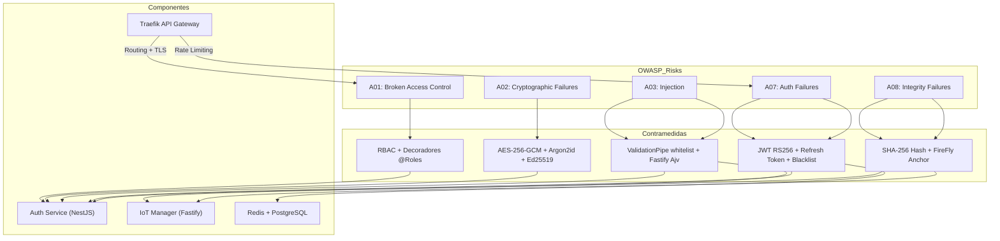
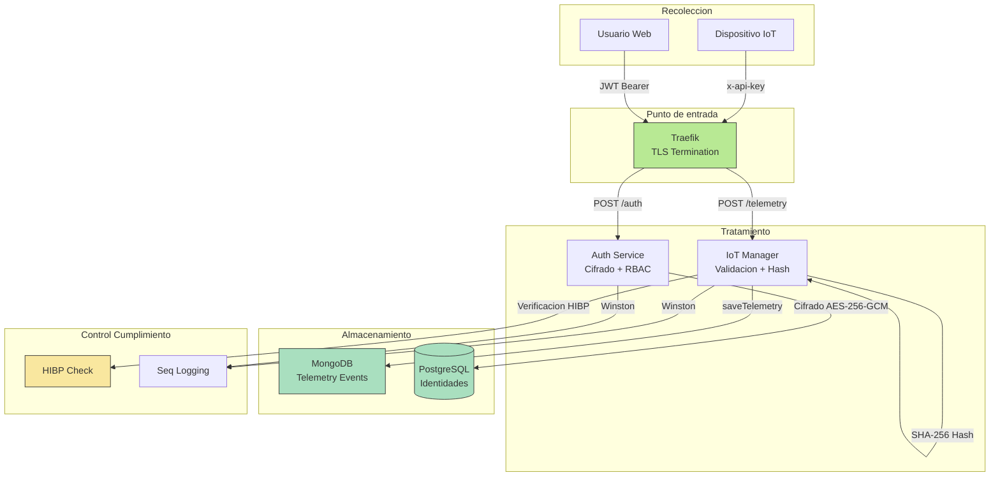
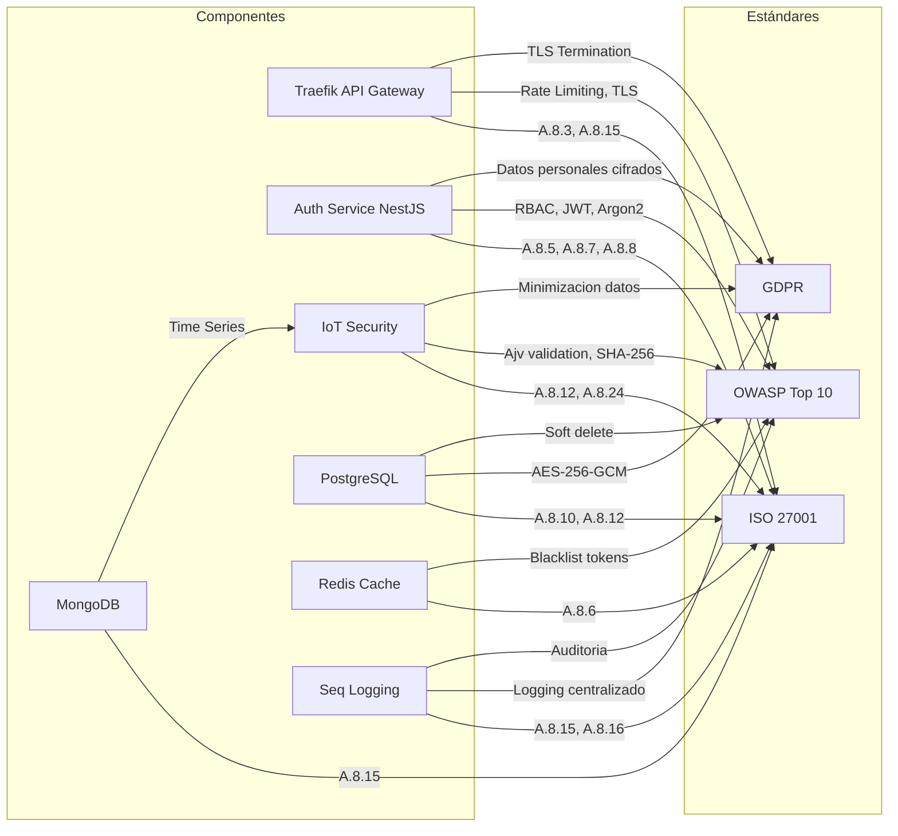
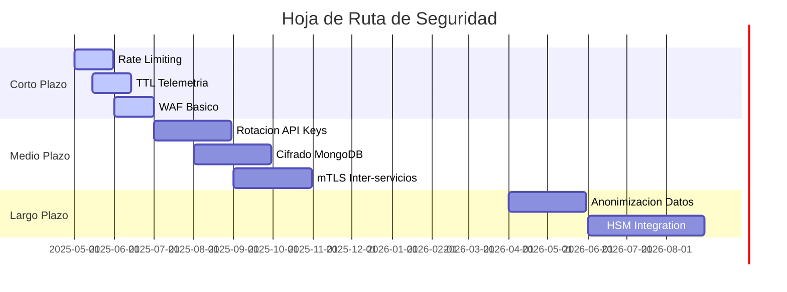

# Alineacion con Estandares y Buenas Practicas

## 1. Seguridad en Aplicaciones y APIs (OWASP)

El proyecto AURORA Smart Home implementa multiples capas de proteccion que mitigan los riesgos identificados en el OWASP Top 10 (2021) y el OWASP API Security Top 10 (2023). A continuacion se analiza cada vector de ataque y las contramedidas implementadas.

### 1.1 Analisis de Riesgos OWASP

| Riesgo OWASP | Nivel de Riesgo | Contramedida Implementada |
|--------------|-----------------|---------------------------|
| A01:2021 - Broken Access Control | Alto | RBAC con decoradores @Roles, validacion de permisos en cada endpoint, verificacion de propietario de recursos |
| A02:2021 - Cryptographic Failures | Alto | AES-256-GCM para claves, Argon2id para contrasenas, JWT RS256, Ed25519 para firmas |
| A03:2021 - Injection | Bajo | Validacion de esquemas con class-validator (whitelist: true), Fastify Ajv schemas |
| A04:2021 - Insecure Design | Medio | Arquitectura de microservicios, validacion en frontend y backend, politico de contrasenas robusta |
| A05:2021 - Security Misconfiguration | Medio | Docker socket proxy con permisos limitados, exposing solo puertos necesarios, Traefik como API Gateway |
| A06:2021 - Vulnerable and Outdated Components | Medio | Actualizacion regular de imagenes Docker (postgres:15-alpine, mongo:7.0, node:22-alpine) |
| A07:2021 - Identification and Authentication Failures | Medio | JWT con duracion de 5 min, refresh token de 7 dias con hash en BD, blacklist en Redis |
| A08:2021 - Software and Data Integrity Failures | Alto | Firmas digitales Ed25519, anclaje en blockchain (FireFly), integridad via SHA-256 hash |
| A09:2021 - Security Logging and Monitoring Failures | Bajo | Logging centralizado con Seq, requestId propagado, global exception filter |
| A10:2021 - Server-Side Request Forgery (SSRF) | Bajo | Traefik como unico punto de entrada, red aislada aurora-secure-net |

### 1.2 Contramedidas Clave

**Validacion de Entrada (Inyeccion):**
- El Auth Service utiliza `ValidationPipe` con `whitelist: true`, lo que ignora cualquier propiedad no definida en el DTO.
- Fastify en IoT Manager valida esquemas JSON con Ajv antes del procesamiento.
- Los payload de telemetría se normalizan y hashean antes del almacenamiento.

**Gestion de Identidades (Broken Access Control):**
- Implementacion de RBAC con cuatro roles: GLOBAL_ADMIN, ADMIN, AUDITOR, USER.
- Decoradores `@Roles()` en cada endpoint que requiere autorizacion.
- Verificacion de propietario en operaciones sensibles (usuarios solo pueden modificar sus propios recursos).

**Cifrado de Datos (Cryptographic Failures):**
- Claves privadas de ecosistemas y usuarios cifradas con AES-256-GCM usando clave maestra.
- API Keys de ecosistemas cifradas con `API_KEY_ENCRYPTION_KEY` independiente.
- Hash de contrasenas con Argon2id (resistente a GPU/ASIC).

**Firmas Digitales (Software Integrity):**
- Cada registro de telemetria incluye un hash SHA-256 que se firma digitalmente.
- La firma se publica en blockchain (FireFly) para crear un registro inmutable.

### 1.3 Diagrama de Mitigacion de Vectores de Ataque

## 2. Proteccion de Datos y Privacidad (GDPR)

El proyecto AURORA Smart Home se disena siguiendo los principios de "Privacidad desde el Diseno" (Privacy by Design) y "Proteccion de Datos por Defecto" (Data Protection by Default) requeridos por el Reglamento General de Proteccion de Datos (RGPD).

### 2.1 Principios de Proteccion de Datos Aplicados

| Principio GDPR | Implementacion en AURORA |
|----------------|-------------------------|
| Minimizacion de datos | Solo se recogen datos necesarios para la funcionalidad (email, rol, MAC address de dispositivos, telemetria). No se recogenden innecesarios. |
| Limitacion del purpose | Los datos de telemetria se usan exclusivamente para monitoreo y auditoria. Las identidades criptograficas se usan para firma digital. |
| Exactitud | Las coordenadas GPS se actualizan en cada ingestion de telemetria. Los dispositivos tienen timestamps de actualizacion. |
| Limitacion de conservacion | No se implementa TTL actualmente. Los datos se conservan indefinidamente para auditoria e investigacion. (Area de mejora). |
| Integridad y confidencialidad | Cifrado AES-256-GCM en reposo, hashes Argon2id para contrasenas, TLS en comunicaciones. |
| Responsabilidad | Logging centralizado en Seq con requestId para trazabilidad de operaciones. |

### 2.2 Datos Personales Identificados

El sistema procesa los siguientes datos que pueden constituir datos personales bajo el RGPD:

| Tipo de Dato | Categoria RGPD | Proteccion Aplicada |
|--------------|----------------|---------------------|
| Email del usuario | Datos identificativos | Hash de refresh token, acceso solo via RBAC |
| PasswordHash | Datos de autenticacion | Argon2id (irreversible) |
| Claves criptograficas (publicKey) | Datos biometricos/tecnicos | Almacenamiento en texto plano (necesario para verificacion) |
| MAC address de dispositivos | Datos de localizacion | Cifrado no aplicado (area de mejora) |
| Coordenadas GPS | Datos de localizacion | Almacenamiento en texto plano en MongoDB |
| Telemetria (payload) | Datos operativos | Hash SHA-256 para integridad |

### 2.3 Derechos de los Interesados

El modelo de datos permite implementar los siguientes derechos:

- **Derecho de acceso**: Los usuarios pueden consultar sus datos via endpoints GET /users/me.
- **Derecho de rectificacion**: Endpoints PATCH para actualizar datos de perfil.
- **Derecho de supresion**: Los usuarios revocados (status = REVOKED) tienen sus datos pseudonimizados (email modificado a "REVOKED_" + id).
- **Derecho a la portabilidad**: Los datos pueden exportarse en formato JSON via los endpoints de consulta.

### 2.4 Flujo de Datos Seguro (GDPR)

## 3. Gestion de Seguridad de la Informacion (ISO/IEC 27001)

El proyecto AURORA Smart Home implementa multiples controles tecnicos que se alinean con los requisitos del Anexo A de la norma ISO/IEC 27001:2022.

### 3.1 Mapeo de Controles ISO 27001

| Control ISO 27001 | Implementacion en AURORA | Componente |
|-------------------|-------------------------|------------|
| A.5.1 Politicas de seguridad | Documentada implicitamente en la arquitectura | Documentacion del proyecto |
| A.6.1.2 Segmentacion de responsabilidades | RBAC con 4 roles diferenciados | Auth Service |
| A.8.2 Privilegios | Asignacion de privilegios minima segun rol | RBAC implementation |
| A.8.3 Gestion de acceso | JWT + RBAC + refresh token | Auth Service |
| A.8.5 Secure authentication | Argon2id para contrasenas | UsersService |
| A.8.6 Capacidad de撤销 | Blacklist en Redis + status REVOKED en BD | Auth Service |
| A.8.7 Cifrado | AES-256-GCM para claves, Ed25519 para firmas | CryptoService |
| A.8.8 Gestion de claves | Clave maestra + clave de cifrado de API keys | CryptoService + EcosystemsService |
| A.8.10 Eliminacion de informacion | Soft delete via status REVOKED | Todas las entidades |
| A.8.12 Cifrado de datos en reposo | AES-256-GCM en PostgreSQL | CryptoService |
| A.8.15 Logging | Winston + Seq centralizado | Todos los servicios |
| A.8.16 Monitorizacion | Seq Dashboard + Traefik Dashboard | Infraestructura |
| A.8.24 Uso de criptografia | Ed25519, AES-256-GCM, Argon2id, SHA-256 | CryptoService |
| A.8.32 Desarrollo seguro | ValidationPipe whitelist, DTOs tipados | NestJS + Fastify |

### 3.2 Analisis de Controles Clave

**A.8.3 Gestion de identidades (Identity and Access Management):**

El sistema implementa un ciclo de vida completo de identidades:
- Creacion: Registro de usuario con validacion de email y contrasena.
- Aprobacion: Un ADMIN debe aprobar usuarios pendientes para generar sus claves criptograficas.
- Modificacion: Roles y estados pueden cambiarse segun jerarquia de permisos.
- Revocacion: Los usuarios revocados tienen acceso denegado y sus datos se pseudonimizan.

**A.8.7 y A.8.8 Criptografia y Gestion de Claves:**

El CryptoService implementa:
- Generacion de claves Ed25519 para usuarios y ecosistemas.
- Cifrado de claves privadas con AES-256-GCM usando clave maestra.
- Cifrado de API Keys de ecosistemas con clave independiente.
- Firma digital de telemetria para integridad.

**A.8.15 Logging:**

La integracion con Seq proporciona:
- Trazabilidad de cada peticion via requestId.
- Logging de operaciones sensibles (creacion, modificacion, eliminacion de usuarios).
- Retencion de logs para auditoria forense.

### 3.3 Matriz de Controles

## 4. Estandares Especificos de IoT

El proyecto AURORA Smart Home aborda requisitos de seguridad especifica para dispositivos del Internet de las Cosas, alineandose con las recomendaciones del OWASP IoT Top 10 y el estandar ETSI EN 303 645.

### 4.1 Analisis de Requisitos de Seguridad IoT

| Requisito ETSI EN 303 645 | Implementacion en AURORA | Estado |
|---------------------------|--------------------------|--------|
| D1 No credenciales por defecto | Cada ecosistema tiene API Key unica y revocable | Implementado |
| D2 Implementar mecanismos de actualizacion | API Key puede rotarse via endpoint | Implementado |
| D3 Almacenamiento seguro de secretos | Claves privadas cifradas con AES-256-GCM | Implementado |
| D4 Comunicacion segura | TLS en todas las comunicaciones externas | Implementado |
| D5 Seguridad de configuracion por defecto | Traefik con politica restrictiva | Implementado |
| D6 Proteccion de interfaces | API Gateway con autenticacion obligatoria | Implementado |
| D7 Actualizacion de software segura | No aplica (no es funcionalidad del proyecto) | N/A |
| D8 Eliminacion segura de datos | Soft delete via status REVOKED | Implementado |

### 4.2 Gestion de Identidades de Dispositivos

El sistema implementa un modelo de identidad para dispositivos IoT:

1. **Registro de ecosistema**: El usuario crea un ecosistema y recibe una API Key unica.
2. **Autenticacion de dispositivo**: Cada peticion de telemetria incluye la API Key del ecosistema.
3. **Descubrimiento de dispositivo**: Los dispositivos se registran automaticamente en PostgreSQL via el DeviceDiscoveryService.
4. **Resolucion de vendor**: Las MAC addresses se resuelven contra la API externa macvendors.com.

**Seguridad de la API Key:**
- Las API Keys se generan como `AUR-{32 bytes aleatorios en base64url}`.
- Se almacenan cifradas en PostgreSQL (AES-256-GCM).
- Se validan contra la base de datos o el cache de Redis.
- No hay limites de uso por clave (area de mejora para rate limiting por ecosistema).

### 4.3 Integridad de Datos de Telemetria

El sistema garantiza la integridad de los datos de telemetria mediante:

1. **Normalizacion del payload**: Los objetos se ordenan deterministicamente antes de calcular el hash.
2. **Calculo de hash SHA-256**: Se genera un hash del payload + coordenadas GPS.
3. **Firma digital**: El hash se firma con la clave privada Ed25519 del ecosistema.
4. **Anclaje en blockchain**: La firma se publica en FireFly (mockeado) para crear un registro inmutable.
5. **Verificabilidad**: Cualquier dato historico puede verificarse contra la firma y el hash almacenados.

### 4.4 Modelo de Amenazas IoT y Contramedidas

| Amenaza | Probabilidad | Impacto | Contramedida |
|---------|--------------|---------|---------------|
| Suplantacion de dispositivo (API Key robada) | Media | Alto | TTL de cache negativo de 15s, revocacion de API Keys |
| Manipulacion de telemetria | Baja | Muy Alto | Hash SHA-256 + Firma Ed25519 + Blockchain |
| Intercepcion de comunicaciones | Baja | Alto | TLS obligatorio via Traefik |
| Denegacion de servicio | Media | Medio | Rate limiting en Redis (a implementar) |
| Extraccion de claves | Baja | Muy Alto | Claves privadas cifradas en reposo |

## 5. Analisis de Brechas (Gap Analysis) y Recomendaciones

Esta seccion identifica las areas de mejora para alcanzar una conformidad total con los estandares analizados.

### 5.1 Debilidades Detectadas

| Area | Debilidad | Severidad | Estandar Afectado |
|------|-----------|-----------|-------------------|
| Cifrado | Las MAC addresses y coordenadas GPS no estan cifradas en MongoDB | Alta | GDPR, ISO 27001 A.8.12 |
| Rotacion de claves | No hay rotacion automatica de la clave maestra ni de las claves de ecosistema | Alta | ISO 27001 A.8.8 |
| Retencion de datos | No existe politica de borrado automatico (TTL) para datos de telemetria | Media | GDPR |
| Rate limiting | No hay limitacion de peticiones por ecosistema/dispositivo | Media | OWASP, ETSI |
| mTLS | Las comunicaciones inter-servicios no usan mTLS | Media | ISO 27001, Zero Trust |
| Actualizaciones | No aplica (no es funcionalidad del proyecto) | N/A | - |
| Anonimizacion | Los datos de telemetria no pueden anonimizarse para analisis | Baja | GDPR |
| WAF | Traefik no esta configurado como WAF con reglas de proteccion | Media | OWASP |

### 5.2 Recomendaciones de Seguridad

**Corto plazo (Sprint actual):**
- Implementar rate limiting por ecosistema en Redis.
- Añadir TTL a la coleccion de telemetria de MongoDB (ej. 1 ano).
- Configurar reglas de WAF basicas en Traefik.

**Medio plazo (Siguientes sprints):**
- Implementar rotacion automatica de API Keys de ecosistemas.
- Cifrar campos de localizacion (MAC, lat/long) en MongoDB.
- Implementar mTLS entre servicios internos.

**Largo plazo (Investigacion futura):**
- Implementar anonimizacion de datos para analisis sin PII.
- Integrar modulo de Hardware Security Module (HSM) para gestion de claves.

### 5.3 Hoja de Ruta de Seguridad

---

## Resumen de Alineacion

El proyecto AURORA Smart Home demuestra un nivel de madurez de seguridad elevado para un proyecto de investigacion, con implementaciones solidas en areas criticas como:

- **Gestion de identidades**: RBAC completo, JWT RS256, Argon2id.
- **Cifrado**: AES-256-GCM para datos en reposo, Ed25519 para firmas.
- **Integridad**: Hash SHA-256 + blockchain para telemetria.
- **Logging**: Trazabilidad completa via Seq.

Las areas de mejora identificadas no representan vulnerabilidades criticas inmediatas, pero deberian abordarse en futuras iteraciones para alcanzar un nivel de conformidad comparable con sistemas de produccion comerciales.