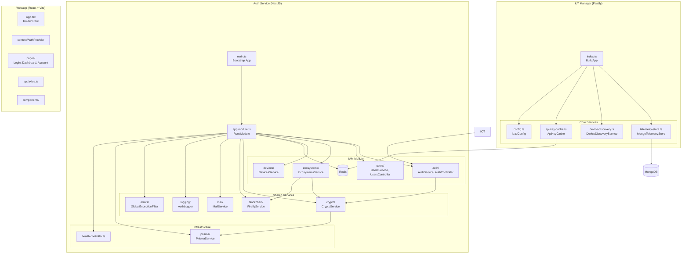
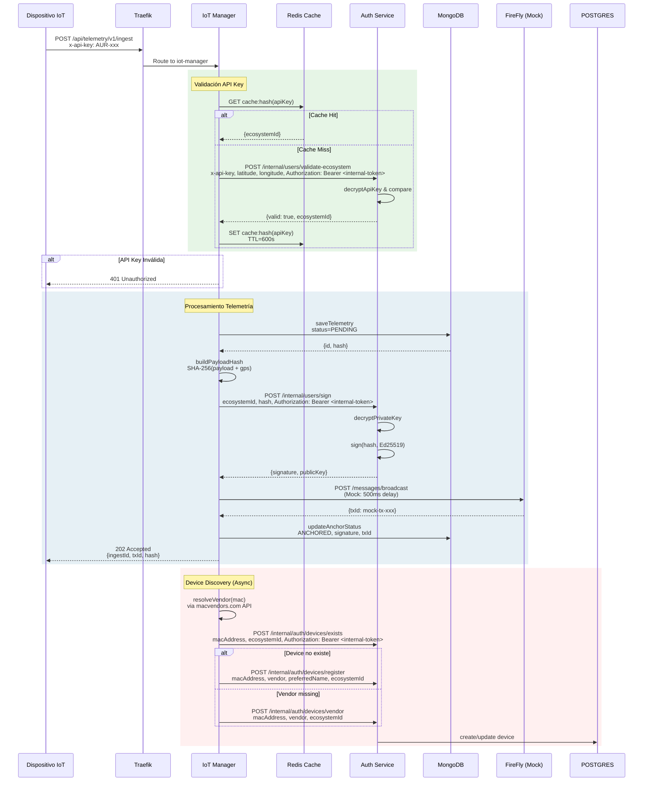

# Arquitectura del Proyecto

## 1. Visión General

El proyecto **AURORA Smart Home** es una plataforma de investigación en ciberseguridad para la gestión, monitoreo y auditoría de dispositivos IoT en ecosistemas distribuidos. El sistema utiliza una arquitectura de microservicios desplegada mediante **Docker Compose**, con cada servicio ejecutándose en su propio contenedor dentro de la red bridge `aurora-secure-net`.

La topología está diseñada alrededor de un **API Gateway** basado en Traefik, que enruta el tráfico HTTP hacia los servicios backend y despliega una aplicación web estática servida por Caddy. El enfoque separa responsabilidades en:

- **auth-service**: backend NestJS para identidad, autorización, ecosistemas y operaciones criptográficas.
- **iot-manager**: backend Fastify para ingestión de telemetría, validación de API keys y persistencia en MongoDB.
- **webapp**: frontend React + Vite servido estáticamente con Caddy.

Además, la infraestructura incluye componentes auxiliares para datos, cache, logging y administración.

## 2. Diagrama de Contexto y Entorno

```mermaid

graph TB
    subgraph "Red Externa"
        USUARIO[Usuario/Investigador]
        DISPOSITIVO_IoT[Dispositivo IoT]
        MAC_VENDOR_API[API MacVendors]
    end

    subgraph "aurora-secure-net"
        subgraph "API Gateway"
            TRAEFIK[Traefik<br/>puertos: 80, 443, 8080]
        end

        subgraph "Servicios de Aplicación"
            WEBAPP[Caddy + React<br/>:80]
            AUTH[NestJS Auth<br/>:3001]
            IOT[Fastify IoT<br/>:3002]
        end

        subgraph "Infraestructura de Datos"
            POSTGRES[(PostgreSQL<br/>:5432)]
            MONGO[(MongoDB<br/>:27017)]
            REDIS_AUTH[(Redis Auth<br/>:6379)]
            REDIS_IOT[(Redis IoT<br/>:6380)]
            SEQ[(Seq Logging<br/>:5341)]
        end

        subgraph "Servicios Auxiliares"
            MAILPIT[Mailpit<br/>SMTP:1025 Web:8025]
            MONGO_EXP[Mongo Express<br/>:8090]
            REDIS_CMD[Redis Commander<br/>:8091]
            DOCKER_PROXY[Docker Socket<br/>Proxy]
        end
    end

    subgraph "Blockchain (Externo)"
        FIREFLY[FireFly API<br/>Hyperledger]
    end

    USUARIO -->|HTTPS| TRAEFIK
    DISPOSITIVO_IoT -->|x-api-key| TRAEFIK
    TRAEFIK -->|PathPrefix(`/api/auth`) || PathPrefix(`/api/users`) || PathPrefix(`/api/ecosystems`) || PathPrefix(`/api/devices`)| AUTH
    TRAEFIK -->|PathPrefix(`/api/telemetry`) || PathPrefix(`/api/iot`)| IOT
    TRAEFIK -->|PathPrefix(`/`) && !PathPrefix(`/api`)| WEBAPP

    AUTH -->|Prisma ORM| POSTGRES
    AUTH -->|Redis Client| REDIS_AUTH
    AUTH -->|HTTP| FIREFLY
    AUTH -->|SMTP| MAILPIT

    IOT -->|Mongo Driver| MONGO
    IOT -->|Redis Client| REDIS_IOT
    IOT -->|HTTP POST| AUTH
    IOT -->|API Externa| MAC_VENDOR_API

    AUTH -->|Winston| SEQ
    IOT -->|Fastify Logger| SEQ
    TRAEFIK -->|Docker Provider| DOCKER_PROXY
```

### Entidades y Decisiones del docker-compose.yml

El archivo `docker-compose.yml` define la siguiente topología de servicios:

| Servicio | Imagen | Puertos Expuestos | Propósito |
|----------|--------|-------------------|-----------|
| **api-gateway** | traefik:latest | 80, 443, 8080 | Reverse proxy, router y dashboard de Traefik |
| **auth-service** | Build local (NestJS) | 3001 (interno) | Autenticación, gestión de usuarios y ecosistemas |
| **iot-manager** | Build local (Fastify) | 3002 (interno) | Ingestión de telemetría IoT |
| **webapp** | caddy:2.8.4-alpine | 80 (interno) | Interfaz web estática |
| **postgres-db** | postgres:15-alpine | 127.0.0.1:5432 | Base de datos relacional para auth-service |
| **mongo-db** | mongo:7.0 | interno | Almacenamiento de telemetría |
| **redis-auth** | redis:7-alpine | 6379 | Cache de auth-service y blacklist de tokens |
| **redis-iot** | redis:7-alpine | 6380 | Cache de API keys del IoT Manager |
| **seq** | datalust/seq:latest | 5341, 8081 | Centralización de logs |
| **mailpit** | axllent/mailpit | 1025, 8025 | SMTP y web UI para pruebas de correo |
| **mongo-express** | mongo-express | 127.0.0.1:8090 | Administración MongoDB |
| **redis-commander** | rediscommander | 127.0.0.1:8091 | Administración Redis |
| **docker-socket-proxy** | tecnativa/docker-socket-proxy | interno | Proxy para acceso seguro de Traefik al socket Docker |

**Decisiones de Seguridad en la Red:**
- `mongo-express` y `redis-commander` están expuestos solo en `127.0.0.1`, evitando acceso remoto no autorizado.
- `mongo-db` permanece dentro de la red interna y no se publica directamente al host.
- Traefik usa el proveedor Docker a través de `docker-socket-proxy` y solo enruta servicios con etiquetas explícitas.
- `webapp` solo sirve tráfico estático y está protegido contra rutas `/api` y `/traefik` mediante reglas de Stripprefix.

## 3. Módulos y Componentes Internos



### Responsabilidad de Cada Módulo

#### Auth Service (NestJS - Puerto 3001)

| Módulo | Responsabilidad |
|--------|----------------|
| **AuthModule** | Gestión de autenticación JWT, login, logout, refresh tokens, recuperación de contraseña mediante tokens de un solo uso (OTP). Implementa guardias de roles con Passport-JWT. |
| **UsersModule** | CRUD de usuarios, hashing de contraseñas con Argon2, gestión de estados y refresh tokens. |
| **EcosystemsModule** | Gestión de ecosistemas IoT, creación y validación de API keys, firma de hashes con Ed25519. |
| **DevicesModule** | Registro y actualización de dispositivos vinculados a ecosistemas, búsqueda por MAC address y vendor. |
| **RedisModule** | Cache de datos y blacklist de tokens revocados. |
| **CryptoModule** | Criptografía central para firmas Ed25519, AES-256-GCM y hashing SHA-256. |
| **BlockchainModule** | Integración con FireFly para broadcast de anchors y transacciones blockchain (mock en desarrollo). |
| **MailModule** | Envío de correos transaccionales mediante Nodemailer y Mailpit. |
| **PrismaService** | Acceso a PostgreSQL con Prisma ORM, migraciones y seed. |

#### IoT Manager (Fastify - Puerto 3002)

| Módulo | Responsabilidad |
|--------|----------------|
| **index.ts (buildApp)** | Servidor Fastify, rutas POST `/v1/ingest`, GET `/iot/devices/last-interaction`, GET `/devices/last-interaction`, GET `/iot/devices/:deviceId/last-interaction`, GET `/devices/:deviceId/last-interaction`, GET `/v1/metrics` y GET `/api/telemetry/v1/metrics`; autenticación de API key para ingestión y autorización JWT para métricas. |
| **telemetry-store.ts** | Persistencia de telemetría en MongoDB, actualización de estados de anclaje, cálculo de métricas y última interacción por dispositivo. |
| **device-discovery.ts** | Resolución de vendors MAC, registro de dispositivos en auth-service y sincronización de metadatos. |
| **api-key-cache.ts** | Cache Redis para validación de API keys, TTL configurable y fallback a auth-service. |
| **config.ts** | Carga y validación de variables de entorno. |

### Endpoints clave de IoT Manager

- `POST /api/telemetry/v1/ingest` / `/v1/ingest` - Ingestión de telemetría con `x-api-key`.
- `GET /iot/devices/last-interaction?macAddress={mac}&ecosystemId={eco}` / `GET /devices/last-interaction?macAddress={mac}&ecosystemId={eco}` - Última interacción por MAC.
- `GET /iot/devices/{deviceId}/last-interaction` / `GET /devices/{deviceId}/last-interaction` - Última interacción por ID de dispositivo.
- `GET /v1/metrics` / `GET /api/telemetry/v1/metrics` - Métricas de telemetría con cabecera `Authorization: Bearer <token>`.

#### Webapp (React - Puerto 80 via Caddy)

| Componente | Responsabilidad |
|------------|-----------------|
| **App.tsx** | Router principal y rutas protegidas. |
| **AuthProvider** | Contexto de autenticación y gestión de sesión. |
| **pages/** | Vistas de login, dashboard, cuenta y gestión de dispositivos. |
| **api/axios.ts** | Cliente HTTP con interceptores de autenticación. |
| **MainLayout** | Layout común con navegación, encabezado y sidebar. |

## 4. Flujo de Ejecución y Secuencias

### Diagrama de Secuencia: Ingestión de Telemetría



## 5. Pila Tecnológica e Infraestructura

### Lenguajes y Frameworks

| Componente | Tecnología | Versión |
|------------|------------|---------|
| **Auth Service** | Node.js + NestJS | Node 22 / NestJS 10 |
| **IoT Manager** | Node.js + Fastify | Node 20 / Fastify 5 |
| **Webapp** | React + Vite | React 19 / Vite 8 |
| **Base de Datos Relacional** | PostgreSQL | 15-alpine |
| **Base de Datos Documental** | MongoDB | 7.0 |
| **Cache y Sesiones** | Redis | 7-alpine |
| **Logging Centralizado** | Seq | latest |
| **Reverse Proxy** | Traefik | latest |
| **Servidor Web Estático** | Caddy | 2.8.4-alpine |

### Librerías de Seguridad y Redes Críticas

#### Auth Service (package.json)
- `@nestjs/jwt`, `passport-jwt`: JWT RS256 y guardias de autenticación.
- `argon2`: Hashing de contraseñas.
- `axios`: Llamadas HTTP entre servicios.
- `@prisma/client`: ORM PostgreSQL.
- `ioredis`: Cache de tokens y sesión.
- `nodemailer`: Envío de correos.
- `winston` + `winston-seq`: Logging estructurado a Seq.

#### IoT Manager (package.json)
- `fastify`: Servidor HTTP rápido con validación de esquemas.
- `ioredis`: Cache API key.
- `mongodb`: Driver MongoDB.
- `dotenv`: Carga de variables de entorno.

#### Webapp (package.json)
- `axios`: Comunicación HTTP con los servicios.
- `react-router-dom`: Enrutamiento cliente y rutas protegidas.
- `leaflet` + `react-leaflet`: Visualización de dispositivos en mapa.
- `recharts`: Gráficas de telemetría.

### Configuración de Contenedores

#### Construcción de Imágenes
- **Auth Service**: Construido localmente desde `services/auth/Dockerfile`.
- **IoT Manager**: Construido localmente desde `services/iot-manager/Dockerfile`.
- **Webapp**: Servida estáticamente desde `apps/webapp/dist` con Caddy.

#### Variables de Entorno Críticas
- `DATABASE_URL`: Conexión PostgreSQL.
- `CRYPTO_MASTER_KEY`: Clave maestra para cifrado AES-256-GCM.
- `JWT_PRIVATE_KEY` / `JWT_PUBLIC_KEY`: Par de claves RSA para JWT.
- `FIREFLY_API_URL`: Endpoint de la blockchain Hyperledger.
- `MONGO_URI`: Conexión MongoDB.
- `REDIS_URL`: Conexión Redis para `iot-manager`.

### Servicios de Monitorización y Administración
- **Seq**: Monitorización de logs y auditoría.
- **Mongo Express**: GUI MongoDB en `127.0.0.1:8090`.
- **Redis Commander**: GUI Redis en `127.0.0.1:8091`.
- **Traefik Dashboard**: Accesible en `/traefik`.
- **Mailpit**: SMTP en `127.0.0.1:1025` y UI en `127.0.0.1:8025`.
