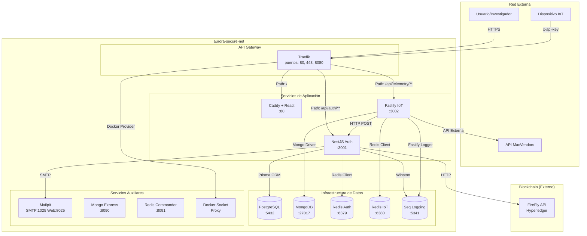
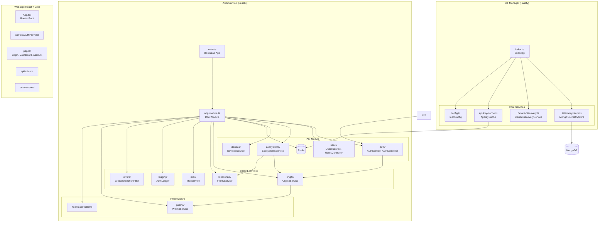
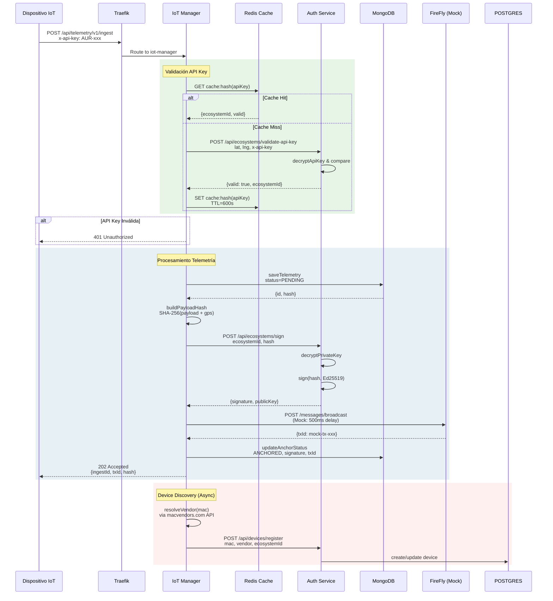
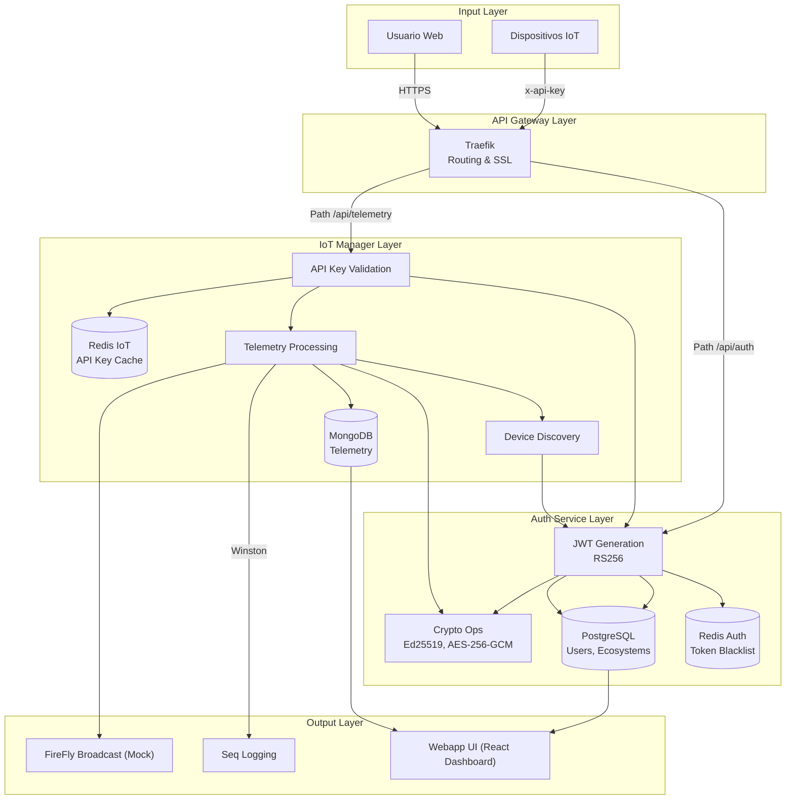

# Arquitectura del Proyecto

## 1. Visión General

El proyecto **AURORA Smart Home** es una plataforma de investigación en ciberseguridad diseñada para la gestión, monitoreo y auditoría de dispositivos IoT en ecosistemas distribuidos. El sistema implementa un paradigma de arquitectura de microservicios orientado a la evaluación de vulnerabilidades en entornos controlados y al diseño de contramedidas criptográficas para la protección de datos de telemetría.

El despliegue se realiza mediante **Docker Compose**, donde cada servicio opera en un contenedor aislado dentro de una red bridge dedicada denominada `aurora-secure-net`. La arquitectura sigue el patrón de **API Gateway** utilizando Traefik como reverse proxy y balanceador de carga, lo que permite el enrutamiento inteligente basado en rutas path-prefix y la exposición segura de servicios hacia el exterior.

El sistema se compone de tres pilares fundamentales:

- **Servicio de Autenticación (auth-service)**: Backend NestJS responsable de la gestión de identidades, control de acceso basado en roles (RBAC), generación de tokens JWT con algoritmos asimétricos (RS256), y operaciones criptográficas mediante el módulo CryptoService.
- **Servicio IoT Manager (iot-manager)**: Backend Fastify especializado en la ingestión de telemetría de dispositivos, validación de claves API, almacenamiento en MongoDB, y orquestación del descubrimiento de dispositivos.
- **Aplicación Web (webapp)**: Frontend React con Vite que proporciona la interfaz de usuario para la gestión de ecosistemas, dispositivos y visualización de datos georreferenciados.

La arquitectura incorpora patrones de seguridad avanzados como el cifrado de claves privadas con AES-256-GCM, firmas digitales Ed25519 para la integridad de datos, y una capa de logging centralizada mediante Seq para auditoría forense.

## 2. Diagrama de Contexto y Entorno

### Entidades y Decisiones del docker-compose.yml

El archivo `docker-compose.yml` define la siguiente topología de servicios:

| Servicio | Imagen | Puertos Expuestos | Propósito |
|----------|--------|-------------------|-----------|
| **api-gateway** | traefik:latest | 80, 443, 8080 | Reverse proxy, balanceador y enrutador |
| **auth-service** | Build local (NestJS) | 3001 (interno) | Autenticación, gestión de usuarios y ecosistemas |
| **iot-manager** | Build local (Fastify) | 3002 (interno) | Ingestión de telemetría IoT |
| **webapp** | caddy:2.8.4-alpine | 80 (interno) | Interfaz web estática |
| **postgres-db** | postgres:15-alpine | 5432 (localhost) | Base de datos relacional para identidades |
| **mongo-db** | mongo:7.0 | 27017 (interno) | Almacenamiento de telemetría |
| **redis-auth** | redis:7-alpine | 6379 | Cache de sesiones y token blacklist (auth-service) |
| **redis-iot** | redis:7-alpine | 6380 | Cache de claves API (iot-manager) |
| **seq** | datalust/seq:latest | 5341, 8081 | Centralización de logs |
| **mailpit** | axllent/mailpit | 1025, 8025 | Servidor SMTP mock para desarrollo |
| **mongo-express** | mongo-express | 8090 (localhost) | Administración MongoDB |
| **redis-commander** | rediscommander | 8091 (localhost) | Administración Redis |
| **docker-socket-proxy** | tecnativa/docker-socket-proxy | - | Proxy seguro del socket Docker |

**Decisiones de Seguridad en la Red:**
- Los puertos de administración (Mongo Express, Redis Commander) solo exponen a `127.0.0.1`, previniendo acceso desde la red externa.
- Todos los servicios de aplicación residen en la red `aurora-secure-net` con driver bridge.
- Traefik utiliza etiquetas para el descubrimiento dinámico de servicios.

## 3. Módulos y Componentes Internos

### Responsabilidad de Cada Módulo

#### Auth Service (NestJS - Puerto 3001)

| Módulo | Responsabilidad |
|--------|----------------|
| **AuthModule** | Gestión de autenticación JWT, login, logout, refresh tokens, recuperación de contraseña mediante tokens de un solo uso (OTP). Implementa estrategia de protección con Passport-JWT yguardias de roles. |
| **UsersModule** | CRUD de usuarios, gestión de estados (ACTIVE, PENDING, REVOKED, PASSBLOCK), hashing de contraseñas con Argon2, almacenamiento de refresh tokens. |
| **EcosystemsModule** | Creación de ecosistemas IoT, generación de claves API cifradas con AES-256-GCM, gestión del ciclo de vida de ecosistemas, firma de hashes mediante Ed25519. |
| **DevicesModule** | Registro y actualización de dispositivos vinculados a ecosistemas, búsqueda por MAC address, control de vendors. |
| **RedisModule** | Blacklisting de tokens revocados, cacheo de sesiones activas, gestión de rate limiting. |
| **CryptoModule** | Servicios criptográficos centrales: generación de pares de claves Ed25519, cifrado/descifrado con AES-256-GCM, firma digital, verificación de firmas, hash SHA-256. |
| **BlockchainModule** | Integración con Hyperledger FireFly para creación de identidades on-chain y broadcast de anchors (actualmente en modo mock). |
| **MailModule** | Envío de correos electrónicos transaccionales (registro, recuperación de contraseña) utilizando Nodemailer con plantillas Handlebars. |
| **PrismaService** | Capa de acceso a datos PostgreSQL mediante ORM Prisma, gestión de transacciones y migraciones. |

#### IoT Manager (Fastify - Puerto 3002)

| Módulo | Responsabilidad |
|--------|----------------|
| **index.ts (buildApp)** | Aplicación principal Fastify, definición de rutas POST /v1/ingest, GET /devices/last-interaction, middlewares de autenticación API key, pipeline de procesamiento de telemetría. |
| **telemetry-store.ts** | Almacenamiento de datos de telemetría en MongoDB, cálculo de hash SHA-256 del payload, gestión de estados de anchor (PENDING, ANCHORED, FAILED). |
| **device-discovery.ts** | Descubrimiento y sincronización de dispositivos con el servicio de autenticación, resolución de vendors mediante API externa macvendors.com, registro/update de dispositivos. |
| **api-key-cache.ts** | Cacheo en Redis de claves API válidas con TTL configurable (default 10 min), invalidated cache para claves revocadas (TTL 15 seg). |
| **config.ts** | Carga de variables de entorno, validación de configuración requerida. |

#### Webapp (React - Puerto 80 via Caddy)

| Componente | Responsabilidad |
|------------|-----------------|
| **App.tsx** | Routing principal con React Router v7, definición de rutas protegidas y públicas. |
| **AuthProvider** | Context provider para gestión de estado de autenticación, almacenamiento de JWT en memoria, protección de rutas. |
| **pages/** | Componentes de vista: Login, Register, Recover, Reset, Dashboard (visualización de ecosistemas y dispositivos), Account. |
| **api/axios.ts** | Cliente HTTP configurado con interceptores para inyección de tokens JWT y manejo de errores. |
| **MainLayout** | Layout común con navegación, header, sidebar. |

## 4. Flujo de Ejecución y Secuencias

### Diagrama de Secuencia: Ingestión de Telemetría

### Diagrama de Flujo de Datos (Data Flow)

### Descripción del Ciclo de Vida Principal

El flujo de ejecución principal del sistema sigue un patrón de procesamiento de telemetría en 8 pasos:

1. **Recepción de Solicitud**: El dispositivo IoT envía una petición POST a `/api/telemetry/v1/ingest` incluyendo la cabecera `x-api-key` con la clave del ecosistema y un body conteniendo latitud, longitud, array de dispositivos y timestamp opcional.

2. **Validación de API Key (Cache)**: El IoT Manager consulta Redis con el hash SHA-256 de la clave API. Si existe en cache y no ha expirado, se extrae el ecosystemId directamente.

3. **Fallback al Auth Service**: En caso de cache miss, el IoT Manager invoca al endpoint interno de validación del auth-service, que descifra la clave API almacenada en PostgreSQL y verifica su estado activo.

4. **Almacenamiento Inicial**: Los datos de telemetría se persisten en MongoDB con estado inicial `PENDING_ANCHOR`, incluyendo el hash SHA-256 calculado a partir del payload normalizado y las coordenadas GPS.

5. **Solicitud de Firma**: El IoT Manager invoca al endpoint `/api/ecosystems/sign` del auth-service proporcionando el ecosystemId y el hash. El servicio de autenticación recupera la clave privada del ecosistema (descifrada con AES-256-GCM usando la master key) y genera una firma Ed25519.

6. **Broadcast a Blockchain**: La firma, el hash original y la clave pública se envían a FireFly (actualmente mockeado con un retraso de 500ms) para su anclaje en la blockchain. Se obtiene un txId como justificante.

7. **Actualización de Estado**: Una vez confirmado el broadcast, se actualiza el registro en MongoDB con estado `ANCHORED`, incluyendo la firma, clave pública y txId.

8. **Sincronización de Dispositivos (Asíncrono)**: En background, el DeviceDiscoveryService procesa los dispositivos recibidos, consulta la API externa macvendors.com para resolver el vendor por MAC, y registra/actualiza cada dispositivo en PostgreSQL a través del auth-service.

## 5. Pila Tecnológica e Infraestructura

### Lenguajes y Frameworks

| Componente | Tecnología | Versión |
|------------|------------|---------|
| **Auth Service** | Node.js + NestJS | Node 22-alpine |
| **IoT Manager** | Node.js + Fastify | Node 20-alpine |
| **Webapp** | React + Vite | React 19, Vite 8 |
| **Base de Datos Relacional** | PostgreSQL | 15-alpine |
| **Base de Datos Documental** | MongoDB | 7.0 |
| **Cache y Sesiones** | Redis | 7-alpine |
| **Logging Centralizado** | Seq (Datalust) | latest |
| **Reverse Proxy** | Traefik | latest |
| **Servidor Web Estático** | Caddy | 2.8.4-alpine |

### Librerías de Seguridad y Redes Críticas

#### Auth Service (package.json)
- `@nestjs/jwt`: Generación y verificación de tokens JWT con algoritmos RS256.
- `@nestjs/passport` + `passport-jwt`: Implementación de estrategia de autenticación basada en tokens.
- `argon2`: Hashing de contraseñas resistant a ataques de fuerza bruta y GPU.
- `nodemailer`: Envío de correos transaccionales con soporte SMTP.
- `@prisma/client`: ORM con soporte para PostgreSQL.
- `winston` + `winston-seq`: Logging estructurado con exportación a Seq.

#### IoT Manager (package.json)
- `fastify`: Servidor HTTP de alto rendimiento con validación de esquemas.
- `ioredis`: Cliente Redis con soporte para cluster y reconnections.
- `mongodb`: Driver nativo para MongoDB con pooling de conexiones.

#### Webapp (package.json)
- `react-router-dom`: Enrutamiento cliente-side con protección de rutas.
- `axios`: Cliente HTTP con interceptores para autenticación.
- `react-leaflet` + `leaflet`: Mapas interactivos para visualización de dispositivos.
- `tailwindcss`: Framework CSS utility-first.

### Configuración de Contenedores

#### Construcción de Imágenes
- **Auth Service**: Multi-stage build (Node 22-alpine), generación de Prisma Client en tiempo de build, usuario no-root.
- **IoT Manager**: Multi-stage build (Node 20-alpine), compilación TypeScript a JavaScript, usuario no-root.
- **Webapp**: Pre-build externo (Vite), servida por Caddy con configuración Caddyfile para TLS automático.

#### Variables de Entorno Críticas
- `DATABASE_URL`: Conexión PostgreSQL con credenciales.
- `CRYPTO_MASTER_KEY`: Clave maestra para cifrado de claves privadas (Base64 32 bytes).
- `API_KEY_ENCRYPTION_KEY`: Clave para cifrado de API keys de ecosistemas (Base64 32 bytes).
- `JWT_PUBLIC_KEY` / `JWT_PRIVATE_KEY`: Par de claves RSA para firmas JWT.
- `FIREFLY_API_URL`: Endpoint de la blockchain Hyperledger.
- `MONGO_URI`: Connection string MongoDB.
- `REDIS_HOST`: Host del servicio Redis.

### Servicios de Monitorización y Administración

- **Seq**: Dashboard web para análisis de logs con búsqueda full-text y alertas.
- **Mongo Express**: Interfaz administrativa para MongoDB (expuesto solo a localhost).
- **Redis Commander**: Interfaz administrativa para Redis (expuesto solo a localhost).
- **Traefik Dashboard**: Panel de control del API Gateway (expuesto en /traefik).
- **Mailpit**: Interfaz web para inspección de correos electrónicos enviados en desarrollo.

Este diseño arquitectónico proporciona una separación clara de responsabilidades, escalabilidad horizontal para el servicio de IoT, persistencia polyglot (relacional + documental), y una capa de seguridad multicapa que incluye cifrado en reposo, autenticación robusta, y auditoría centralizada.