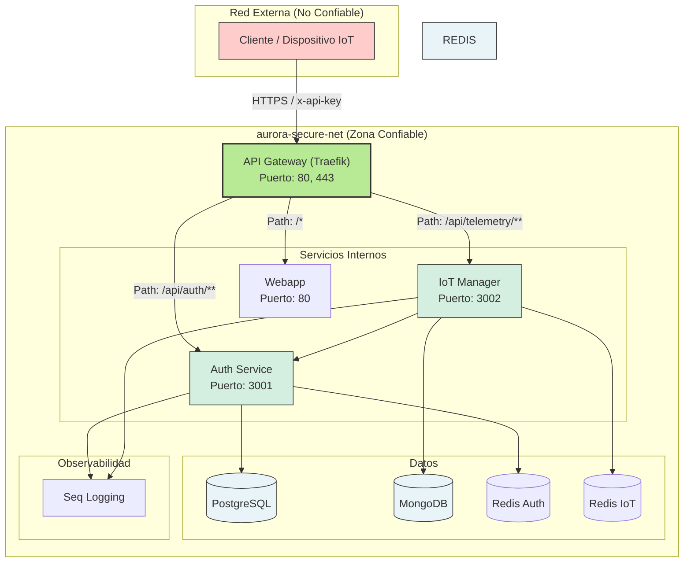
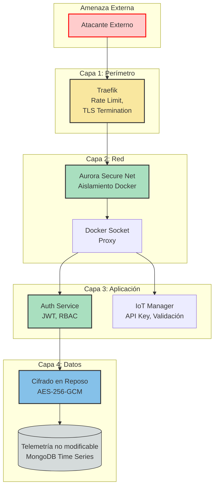
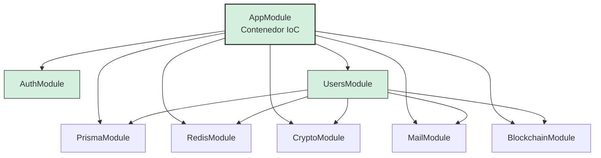
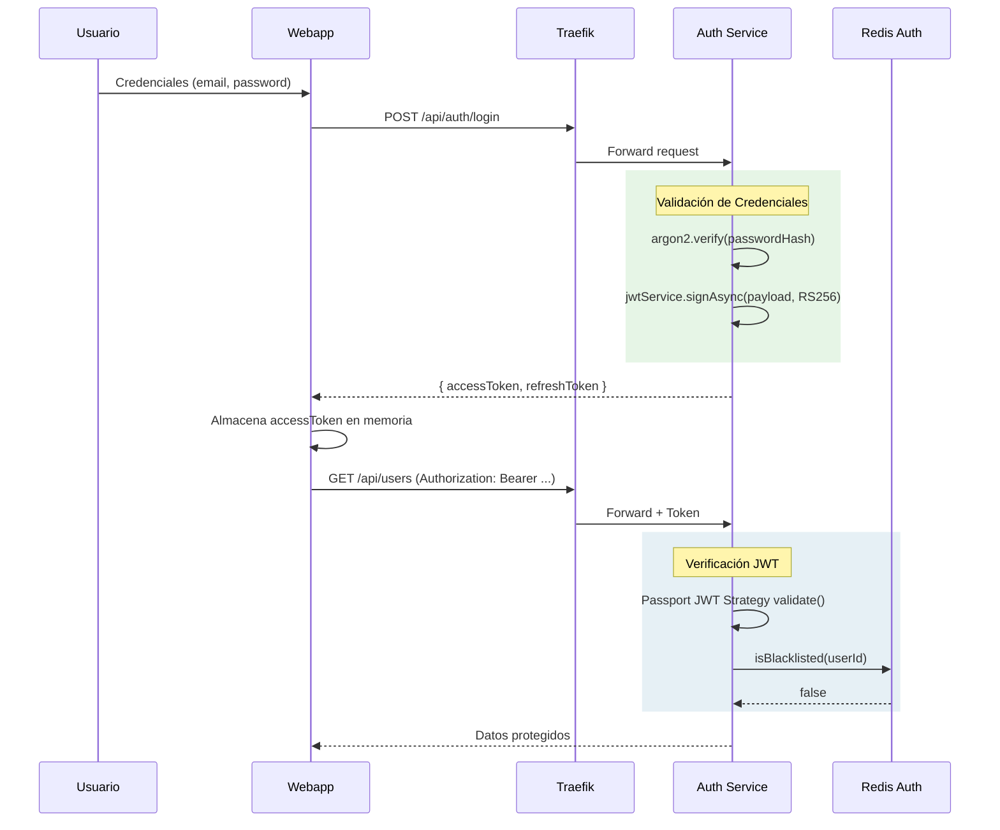
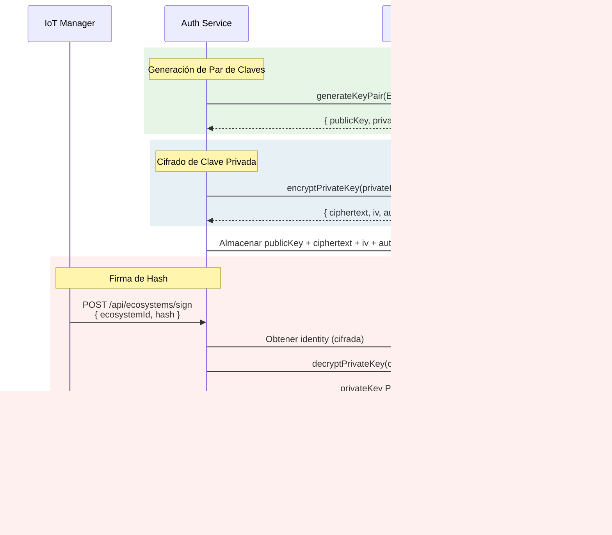
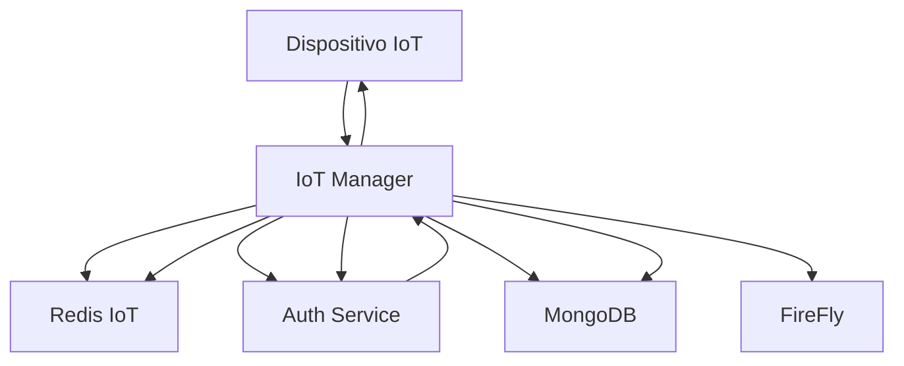
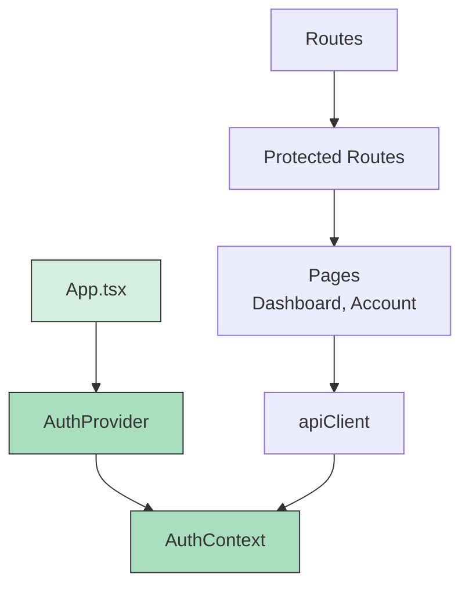
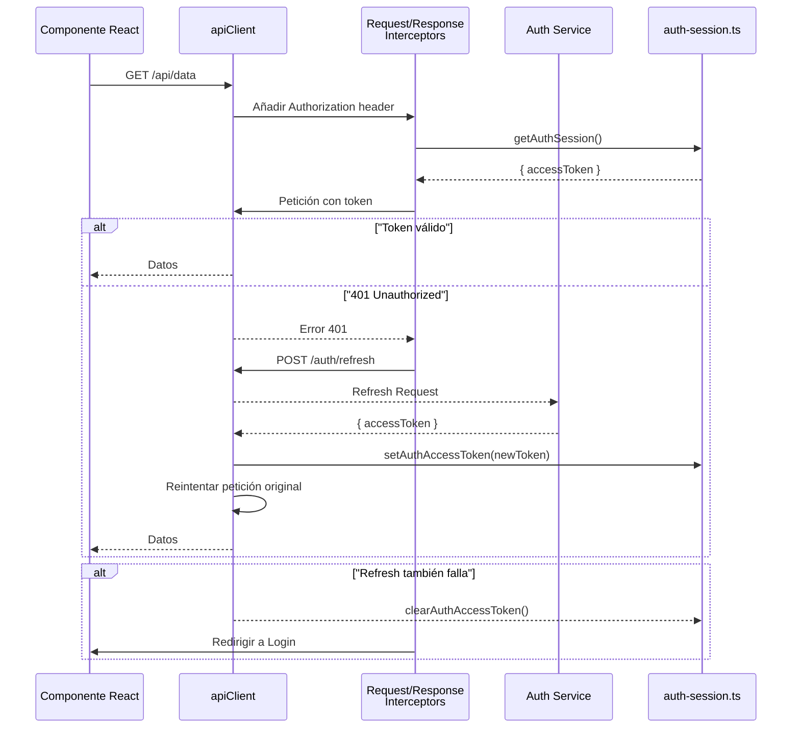
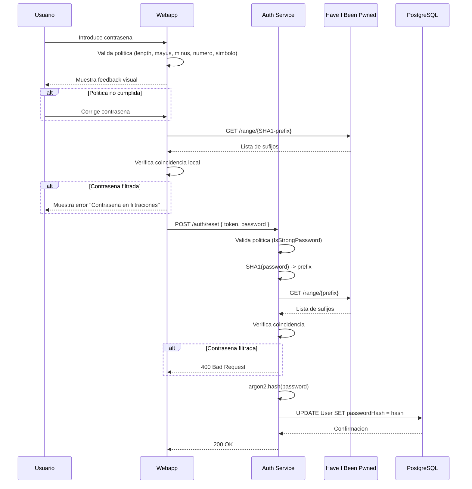

# Patrones de Diseño y Seguridad

## 1. Patrones Arquitectónicos Globales

El ecosistema AURORA Smart Home implementa una arquitectura de microservicios basada en contenedores Docker, donde cada servicio cumple con el principio de **Responsabilidad Única** (Single Responsibility Principle). Esta sección documenta los patrones arquitectónicos de alto nivel que rigen la interacción entre servicios y la infraestructura.

### 1.1 Patrón de Microservicios con API Gateway

El sistema adopta el patrón **API Gateway** como punto de entrada único, implementado mediante Traefik. Este patrón centraliza la gestión de rutas, SSL/TLS y balanceo de carga, delegando la lógica de negocio a los microservicios backend.

**Por qué este patrón mitiga riesgos:**
- **Reducción de Superficie de Ataque**: Los servicios internos no están expuestos directamente a la red externa; solo el API Gatewaylisten en los puertos públicos (80, 443).
- **Centralización de Políticas**: Todas las reglas de enrutamiento y seguridad se definen en un único punto (Traefik + etiquetas Docker), facilitando la auditoría y el mantenimiento.
- **Desacoplamiento**: Los clientes (dispositivos IoT, webapp) no necesitan conocer la ubicación de los servicios internos; el Gateway resuelve las rutas basadas en path-prefix.



### 1.2 Patrón de Reverse Proxy y Balanceo de Carga

Traefik actúa como reverse proxy, detectando automáticamente los servicios disponibles mediante el proveedor Docker. Las etiquetas en el `docker-compose.yml` definen las reglas de enrutamiento:

- `traefik.http.routers.auth.rule=PathPrefix(/api/auth)` — Enrutamiento basado en path.
- `traefik.http.routers.auth.priority=100` — Prioridad para evitar colisiones.
- `traefik.http.middlewares.auth-strip.stripprefix.prefixes=/api` — Normalización de URLs.

### 1.3 Patrón de Logging Centralizado

El sistema implementa el patrón **Centralized Logging** mediante Seq. Todos los servicios (Auth e IoT) utilizan Winston con el transporter `winston-seq` para exportar logs estructurados en formato JSON.

**Por qué este patrón es crítico para seguridad:**
- **Trazabilidad de Auditoría**: Cada operación incluye un `requestId` propagado a través de las capas (generado en `main.ts` del Auth Service).
- **Detección de Anomalías**: Logs centralizados permiten correlacionar eventos distribuidos (ej. múltiples intentos de autenticación fallidos desde una IP).
- **Cumplimiento**: La persistencia de logs en Seq facilita la generación de informes forenses y la retención de evidencias.

### 1.4 Patrón de Comunicación Inter-Servicios

La comunicación entre IoT Manager y Auth Service utiliza HTTP REST sobre la red interna (`aurora-secure-net`), autenticada mediante un **Internal Auth Token** (`AUTH_INTERNAL_TOKEN`). No se utiliza.message queues asíncronas en esta versión.

**Flujo de autenticación inter-servicios:**
- **IoT → Auth**: El IoT Manager incluye el `Authorization: Bearer <INTERNAL_AUTH_TOKEN>` en las peticiones al Auth Service.
- **Webapp → Auth**: El usuario final envía JWT en el header `Authorization: Bearer <JWT>`.
- **Validación centralizada**: El Auth Service valida tanto el JWT de la webapp como el Internal Token del IoT Manager.

**Por qué este patrón es apropiado:**
- **Sincronismo necesarios**: El flujo de ingestión de telemetría requiere confirmación antes de retornar al cliente (firma + broadcast).
- **Simplicidad**: Evitar la complejidad de un broker de mensajes reduce puntos de fallo.
- **Separación de contextos**: El token interno identifica comunicación máquina-máquina; el JWT identifica al usuario humano.
- **Confianza en la red interna**: La comunicación ocurre dentro de la misma red bridge, donde el tráfico no está expuesto externamente.

## 2. Estrategia Global de Seguridad y Contramedidas (Defense in Depth)

El sistema implementa el principio **Defense in Depth** mediante múltiples capas de seguridad que protegen los activos críticos. Cada capa proporciona una barrera adicional que debe ser sorteada por un atacante.



### 2.1 Aislamiento de Contenedores (Docker Socket Proxy)

El servicio `docker-socket-proxy` implementa un patrón de **Proxy de Acceso Restringido** al socket Docker. En lugar de exponer directamente el socket `/var/run/docker.sock` a los contenedores, se utiliza un proxy que filtra las operaciones permitidas.

**Por qué mitiga riesgos:**
- **Prevención de Escape de Contenedor**: Un contenedor comprometido no puede directamente manipular el daemon Docker del host.
- **Principio de Mínimo Privilegio**: El proxy solo permite las operaciones explícitamente habilitadas (en este caso, solo `EVENTS: 1` para lectura de eventos).
- **Auditoría**: Las solicitudes al proxy son registrables, permitiendo detectar comportamiento anómalo.

```yaml
# Configuración del docker-socket-proxy en docker-compose.yml
docker-socket-proxy:
  environment:
    EVENTS: 1        # Solo lectura de eventos
    CONTAINERS: 0    # Denegado
    IMAGES: 0        # Denegado
    BUILD: 0         # Denegado
```

### 2.2 Protección de Puertos y Exposición Mínima

El sistema sigue el principio de **Mínima Exposición** (Least Exposure):

- **Servicios de Administración (Mongo Express, Redis Commander)**: Expuestos exclusivamente en `127.0.0.1`, garantizando que solo el host local puede acceder a las interfaces administrativas.
- **Servicios de Aplicación**: Expuestos solo internamente (`expose: 3001`, `expose: 3002`), accesibilidad vía Traefik.
- **Puertos Públicos**: Solo 80 (HTTP), 443 (HTTPS) y 8080 (Traefik Dashboard) están expuestos al exterior.

### 2.3 Estrategia de Confianza Cero (Zero Trust) en Comunicación Interna

Aunque no se implementa mTLS entre servicios, el sistema aplica principios de Zero Trust:

1. **Autenticación obligatoria**: Cada solicitud incluye credenciales específicas del tipo de cliente:
   - **Dispositivos IoT**: API Key del ecosistema (validada por Auth Service).
   - **Webapp (usuarios)**: JWT Bearer token (validado por Auth Service).
   - **IoT Manager (servicio)**: Internal Auth Token Bearer (validado por Auth Service).
2. **Validación centralizada**: El Auth Service valida todos los tipos de credenciales:
   - Valida JWT de la webapp para proteger endpoints de usuarios.
   - Valida API Keys de ecosistemas para permitir ingestión de dispositivos IoT.
   - Valida el Internal Token para permitir comunicación inter-servicios.
3. **Red aislada**: La red `aurora-secure-net` no permite tráfico entre servicios que no estén explícitamente conectados.

### 2.4 Gestión de Secretos

Los secretos se gestionan mediante variables de entorno inyectadas en tiempo de ejecución:

- `CRYPTO_MASTER_KEY`: Clave maestra para cifrado de claves privadas (Base64, 32 bytes).
- `API_KEY_ENCRYPTION_KEY`: Clave para cifrado de API keys de ecosistemas.
- `JWT_PUBLIC_KEY` / `JWT_PRIVATE_KEY`: Par de claves RSA para firma de tokens.
- Credenciales de bases de datos: Almacenadas en archivos `.env` externos al repositorio.

**Por qué este patrón:**
- **Separación de Configuración**: Los secretos no están en el código fuente ni en imágenes Docker.
- **Rotación**: Los secretos pueden rotarse sin re-desplegar código.
- **Auditoría**: Las variables de entorno son visibles en metadatos del contenedor, facilitando la verificación de configuración.

## 3. Patrones y Seguridad en Auth Service (NestJS)

El Auth Service implementa múltiples patrones de diseño que optimizan la mantenibilidad, testabilidad y seguridad del código.

### 3.1 Patrón de Inyección de Dependencias (DI)

NestJS está construido sobre el patrón de **Inyección de Dependencias** (DI) como mecanismo central de arquitectura. Las dependencias se declaran en los constructores de los módulos y son inyectadas por el contenedor de inversión de control (IoC).

**Por qué este patrón mejora la seguridad:**
- **Testabilidad**: Las dependencias pueden mockearse fácilmente en tests unitarios, permitiendo verificar el comportamiento del código sin exponer datos reales.
- **Claridad de Dependencias**: El árbol de dependencias es explícito, facilitando la auditoría de qué servicios acceden a qué recursos.
- **Configuración Centralizada**: Los módulos configuran las dependencias una sola vez en el `AppModule`, evitando inconsistencias.



### 3.2 Patrón Repository con Prisma

El acceso a datos sigue el patrón **Repository** implementado mediante Prisma ORM. En lugar de construir queries SQL directamente, los servicios utilizan métodos del `PrismaService` que abstraen la capa de datos.

**Por qué este patrón:**
- **Inyección en constructores**: El `PrismaService` se inyecta como dependencia, no se instancia globalmente.
- **Prevención de SQL Injection**: Prisma genera queries parametrizadas automáticamente.
- **Tipado estricto**: El esquema de Prisma define tiposcompile-time que previenen errores de acceso a campos inexistentes.

### 3.3 Patrón de Autenticación JWT con Estrategia Passport

El sistema implementa **JWT-based Stateless Authentication** mediante Passport-JWT. La estrategia `JwtStrategy` se configura con:

- `jwtFromRequest: ExtractJwt.fromAuthHeaderAsBearerToken()`: Extracción del token del header Authorization.
- `algorithms: ['RS256']`: Algoritmo asimétrico que verifica firmas sin exponer la clave privada.
- `ignoreExpiration: false`: Validación automática de expiración del token.

**Por qué RS256 en lugar de HS256:**
- **Separación de Responsabilidades**: La clave privada para firmar reside exclusivamente en el servidor de autenticación; la clave pública puede distribuirse a servicios que solo necesitan verificar tokens.
- **Menor Riesgo en Caso de Compromiso**: Si un servicio intermediate es comprometido, el atacante solo obtiene la clave pública, no puede falsificar tokens.



### 3.4 Control de Acceso Basado en Roles (RBAC)

El sistema implementa **RBAC** mediante el decorador `@Roles()` y el `RolesGuard`. Los roles definidos son:

- `GLOBAL_ADMIN`: Acceso completo a todos los recursos del sistema.
- `ADMIN`: Gestión de usuarios y ecosistemas dentro de su ámbito.
- `AUDITOR`: Acceso de solo lectura para auditoría y supervisión de recursos.
- `USER`: Acceso básico a sus propios recursos.

**Cómo funciona el patrón:**

1. **Decorador**: En cada endpoint, se especifica `@Roles(Role.ADMIN)` para restringir acceso.
2. **Reflector**: El `RolesGuard` utiliza el `Reflector` de NestJS para leer los metadatos del handler.
3. **Verificación**: Se compara el rol del usuario autenticado con los roles requeridos.

**Por qué este patrón:**
- **Principio de Mínimo Privilegio**: Los usuarios solo acceden a lo necesario para su función.
- **Auditoría**: Cada endpoint declare explícitamente qué roles pueden accederlo.
- **Mantenibilidad**: Agregar nuevos roles o modificar permisos no requiere cambios en la lógica de negocio.

### 3.5 Cifrado en Reposo con AES-256-GCM

El sistema utiliza **AES-256-GCM** (Galois/Counter Mode) para el cifrado de datos sensibles en reposo:

- **Claves Privadas de Ecosistemas**: Cifradas con la master key antes de almacenarse en PostgreSQL.
- **API Keys de Ecosistemas**: Cifradas con `API_KEY_ENCRYPTION_KEY` antes de persistirse.

**Por qué GCM:**
- **Integridad autenticada**: GCM incluye un tag de autenticación que detecta manipulación de datos cifrados.
- **Eficiencia**: GCM es un modo de operación paralelizable, adecuado para altas tasas de cifrado.
- **Resistencia a ataques**: No es vulnerable a ataques de padding oracle como CBC.

### 3.6 Generación de Claves y Firmas Ed25519

Cada ecosistema y usuario aprobado genera un par de claves **Ed25519** (Curve25519) para la firma digital de datos de telemetría.

**Por qué Ed25519:**
- **Rendimiento**: Es más rápido que RSA con niveles de seguridad equivalentes.
- **Tamaño de claves**: Claves de 256 bits (32 bytes) vs 2048 bits de RSA.
- **Resistencia**: No es vulnerable a ataques de canal lateral como los que afectan a implementaciones de RSA.
- **Modernidad**: Diseñado específicamente para entornos con restricciones de rendimiento.



### 3.7 Verificación de Contraseñas con Argon2

El sistema utiliza **Argon2id** (variante recomendada por OWASP) para el hashing de contraseñas de usuarios.

**Por qué Argon2:**
- **Resistencia a GPU/ASIC**: Utiliza requisitos de memoria que dificultan ataques con hardware especializado.
- **Configurabilidad**: Parámetros de iteraciones, memoria y paralelismo ajustables.
- **Ganador del Password Hashing Competition (PHC)**: Algoritmo reconocidos como el estado del arte.

**Configuración observada en el código:**
- Costes de memoria e iteraciones configurables mediante variables de entorno.
- Integración directa con la librería `argon2` en Node.js.

### 3.8 Protección contra Credenciales Filtradas (HIBP)

El `UsersService` implementa verificación contra la API **Have I Been Pwned (HIBP)** usando el método de k-anonymity:

1. Se calcula el hash SHA-1 de la contraseña.
2. Se envían los primeros 5 caracteres (prefix) del hash a la API.
3. La API retorna todos los sufijos que coinciden.
4. El cliente verifica localmente si el sufijo completo coincide.

**Por qué este patrón:**
- **Privacidad**: La contraseña completa nunca sale del sistema.
- **Eficiencia**: Solo se transmite una fracción del hash.
- **Prevención**: Bloquea contraseñas que aparecen en filtraciones públicas.

## 4. Patrones y Seguridad en IoT Manager (Fastify)

El servicio de IoT Manager está diseñado para maximizar el rendimiento en la ingestión de datos de telemetría, utilizando patrones específicos del ecosistema Fastify.

### 4.1 Patrón de Middlewares/Hooks en Fastify

Fastify utiliza el concepto de **Hooks** para interceptar el ciclo de vida de las peticiones. El servicio implementa:

- `preHandler`: Hook ejecutado antes del handler de la ruta, utilizado para autenticación de API Key.
- `onClose`: Hook ejecutado al cerrar la aplicación, utilizado para limpiar conexiones a MongoDB y Redis.

**Por qué Hooks en lugar de Middlewares tradicional:**
- **Rendimiento**: Fastify es más eficiente que Express debido a su arquitectura de schema-based compilation.
- **Type Safety**: Los tipos de Fastify proporcionan seguridad compile-time.
- **Scope reducido**: Los Hooks tienen acceso directo al contexto de la petición.

### 4.2 Patrón Cache-Aside con Redis IoT

El servicio implementa el patrón **Cache-Aside** para la validación de claves API:

1. **Check**: Se consulta Redis IoT con el hash SHA-256 de la API Key.
2. **Hit**: Si existe y no ha expirado, se usa el `ecosystemId` cacheado.
3. **Miss**: Se invoca al Auth Service para validar la clave, luego se cachea el resultado.

**Parámetros de cache:**
- **TTL Positivo (válido)**: 600 segundos (10 minutos) — Configurable mediante `IOT_API_KEY_POSITIVE_TTL_MS`.
- **TTL Negativo (inválido)**: 15 segundos — Previene ataques de fuerza bruta mediante cache de rechazos.

**Nota**: El servicio IoT Manager utiliza una instancia Redis dedicada (`redis-iot`) separada del auth-service para cumplir con el patrón de aislamiento Zero Trust.



### 4.3 Validación de Esquemas de Payload

Fastify integra **Ajv** (Another JSON Schema Validator) para la validación estricta de payloads entrantes:

```typescript
// Ejemplo de esquema en el código (index.ts)
schema: {
  body: {
    type: 'object',
    required: ['latitude', 'longitude', 'devices'],
    properties: {
      latitude: { type: 'number' },
      longitude: { type: 'number' },
      devices: {
        type: 'array',
        items: {
          type: 'object',
          required: ['mac_addr'],
          properties: {
            mac_addr: { type: 'string', minLength: 1 }
          }
        }
      }
    }
  }
}
```

**Por qué validación de esquemas:**
- **Prevención de Inyección**: Datos maliciosos son rechazados antes de llegar al código de aplicación.
- **Tipado explícito**: El esquema define exactamente qué campos son aceptados.
- **Rendimiento**: La validación ocurre en la capa de Fastify, antes de cualquier procesamiento.

### 4.4 Patrón de Descubrimiento de Dispositivos Asíncrono

El `DeviceDiscoveryService` implementa un patrón de **Procesamiento Asíncrono en Background**:

1. Después de persistir la telemetría, se dispara el descubrimiento de dispositivos.
2. Para cada dispositivo recibido:
   - Se normaliza la MAC address.
   - Se verifica si existe en el Auth Service.
   - Se resolve el vendor mediante la API externa macvendors.com.
   - Se registra o actualiza el dispositivo.

**Por qué este patrón:**
- **No bloqueante**: La respuesta al cliente no espera la finalizacion del descubrimiento.
- **Resiliencia**: Si el descubrimiento falla, la telemetría ya está persistida.
- **Rate Limiting**: La llamada a la API externa incluye timeout de 5 segundos para evitar bloqueos.

## 5. Patrones y Seguridad en la Webapp (React)

La aplicación web implementa patrones específicos del ecosistema React para la gestión del estado de autenticación y la protección de rutas.

### 5.1 Patrón Provider (Context API)

El sistema utiliza el patrón **Provider** mediante la Context API de React para compartir el estado de autenticación entre componentes:

- `AuthProvider`: Envuelve la aplicación y proporciona el contexto de autenticación.
- `AuthContext`: Define la interfaz (accessToken, isAuthenticated, setSession, clearSession).

**Por qué este patrón:**
- **Evita Prop Drilling**: No es necesario pasar el token por cada nivel de componentes.
- **Reactividad**: Los componentes que consumen el contexto se actualizan automáticamente cuando el token cambia.
- **Separación de Concerns**: La lógica de autenticación está encapsulada en el Provider.



### 5.2 Gestión del Token JWT en Memoria

El sistema almacena el **accessToken en memoria** (no en localStorage ni cookies), mientras que el **refreshToken** se gestiona mediante cookies httponly para permitir la renovación automática de sesiones entre recargas de pagina.

**Por qué este patrón:**
- **Protección contra XSS**: Un token en memoria no puede ser robado mediante scripts maliciosos que lean localStorage.
- **Ephemeralidad**: Al cerrar la pestaña, el token se pierde automaticamente.
- **Sesiones cortas**: El accessToken tiene una vida util de 5 minutos, limitando la ventana de exposicion si el token es robado.
- **Persistencia del refresh**: El refreshToken en cookie permite que el navegador realize automaticamente el refresh al cargar la pagina sin necesidad de que el usuario inicie sesion manualmente.

**Limitaciones conocidas:**
- No persiste entre recargas de pagina (el refresh token en cookie resuelve esto automaticamente).
- No permite multiples pestañas (el refresh token en cookies resuelve parcialmente esto).

### 5.2.1 Estrategia de Doble Token (Access Token + Refresh Token)

El sistema implementa una estrategia de autenticación con dos tokens para optimizar el equilibrio entre seguridad y usabilidad:

| Token | Tiempo de Vida | Almacenamiento | Propósito |
|-------|----------------|----------------|-----------|
| **accessToken** | 5 minutos | Memoria (JavaScript) | Autorizacion de peticiones API |
| **refreshToken** | 7 dias | Cookie httponly + Hash en PostgreSQL | Renovacion automatica del accessToken |

**Modelo de amenazas y contramedidas:**

1. **Acceso no autorizado al accessToken (en memoria):**
   - Riesgo: Si un atacante ejecuta XSS, puede robar el accessToken mientras este vigente.
   - Contramedida: La vida util de 5 minutos limita la ventana de exposicion. Ademas, el token esta en memoria y no es accesible via JavaScript malicioso.

2. **Compromiso del refreshToken (en cookie):**
   - Riesgo: El refreshToken esta en una cookie httponly, lo que protege contra XSS, pero podria ser vulnerable a ataques de red (MITM) si no se usa TLS.
   - Contramedida: El refreshToken se almacena en la base de datos como un hash (no en texto plano). Ademas, el sistema verifica que el refreshToken no haya sido revocado antes de emitir un nuevo accessToken.

3. **Logout (cierre de sesion):**
   - Cuando el usuario cierra sesion, se ejecuta el flujo de logout que:
     - Elimina el hash del refreshToken de la base de datos (tabla `User.hashedRefreshToken` se establece a `null`).
     - Agrega el ID del usuario a la blacklist de Redis para invalidar inmediatamente cualquier accessToken vigente.
     - Limpia el accessToken de la memoria del cliente.

**Por que este modelo de dos tokens:**
- **Reduced ataques de sesion**: Un accessToken robado tiene una vida util maxima de 5 minutos.
- **Experiencia de usuario fluida**: El usuario no necesita iniciar sesion frecuentemente gracias a la renovacion automatica via refreshToken.
- **Control de sesiones**: El servidor puede revocar el refreshToken en cualquier momento (logout, cambio de contrasena, usuario revocado).
- **Auditoria**: Almacenar el hash del refreshToken permite detectar y responder a intentos de uso de tokens revocados.

### 5.3 Patrón de Protected Routes

El componente `RequireAuth` implementa el patrón de **Guards de Ruta**:

```typescript
// Pseudocódigo del comportamiento
if (isHydrating) return null;  // Espera a inicialización
if (!isAuthenticated) return <Navigate to="/login" />;
return <Outlet />;  // Renderiza las rutas hijos
```

**Por qué este patrón:**
- **Seguridad por diseño**: Las rutas protegidas no se renderizan si el usuario no está autenticado.
- **UX fluida**: El estado `isHydrating` previene el "flash" de contenido protected antes de verificar la sesión.
- **Composición**: Utiliza `<Outlet />` de React Router para anidar rutas sin duplicar código.

### 5.4 Interceptors HTTP para Renovación Automática de Tokens

El cliente Axios implementa **Interceptores** para manejar automáticamente la renovación de tokens:

1. **Request Interceptor**: Añade el `Authorization: Bearer <token>` header a cada petición.
2. **Response Interceptor**: Detecta respuestas 401 (Unauthorized) y:
   - Si no es una ruta de auth, intenta refresh del token.
   - Si el refresh falla, limpia la sesión.
   - Reintenta la petición original con el nuevo token.

**Por qué este patrón:**
- **Transparencia**: El código de los componentes no necesita manejar explícitamente la renovación.
- **Resiliencia**: Si el token expira durante el uso, el usuario no pierde trabajo por un error de autenticación.
- **Centralización**: La lógica de autenticación está en un único lugar.



### 5.5 Descodeo de Claims del JWT en Cliente

El archivo `auth-session.ts` implementa la lógica de decodificación del JWT sin verificar la firma (solo extraccción del payload):

**Por qué se decodifica en cliente:**
- Acceso inmediato a los claims (`sub`, `email`, `role`) sin esperar una llamada a la API.
- Renderizado de UI personalizado según el rol del usuario.

**Por qué NO se verifica en cliente:**
- La verificación de firma debe realizarse siempre en el servidor (donde reside la clave pública).
- El decodificador solo parsea el payload para lectura, no para confianza.

## 6. Resumen de Patrones y Contramedidas

| Capa | Patrón | Contramedida de Seguridad |
|------|--------|--------------------------|
| **Infraestructura** | API Gateway (Traefik) | Reducción de superficie, TLS termination |
| **Infraestructura** | Docker Socket Proxy | Prevención de escape de contenedor |
| **Red** | aislamientobridge (aurora-secure-net) | Segmentación de red |
| **Red** | Exposición mínima de puertos | Least Exposure |
| **Auth Service** | JWT con RS256 | Autenticación stateless con claves asimétricas |
| **Auth Service** | Blacklist de tokens en Redis | Revocación inmediata de sesiones |
| **Auth Service** | RBAC con Decoradores | Control de acceso granular |
| **Auth Service** | Argon2 para contraseñas | Resistente a ataques de fuerza bruta |
| **Auth Service** | AES-256-GCM | Cifrado en reposo con integridad autenticada |
| **Auth Service** | Ed25519 | Firmas digitales eficientes y modernas |
| **Auth Service** | HIBP k-anonymity | Bloqueo de contraseñas filtradas |
| **IoT Manager** | Cache-aside (Redis) | Reducción de latencia y carga en Auth Service |
| **IoT Manager** | Validación de esquemas (Ajv) | Prevención de inyección de datos |
| **Webapp** | Provider Pattern | Estado de autenticación centralizado |
| **Webapp** | JWT en memoria | Protección contra XSS |
| **Webapp** | Protected Routes | Prevención de acceso no autorizado |
| **Webapp** | Interceptors HTTP | Renovación automática de tokens |

## 6. Politica de Contrasenas y Validacion

El sistema implementa una politica de contrasenas robusta que abarca tanto la validacion del lado del cliente (frontend) como la validacion del lado del servidor (backend), ademas de una verificacion contra bases de datos de contrasenas filtradas.

### 6.1 Requisitos de la Politica de Contrasenas

El sistema exige los siguientes requisitos para todas las contrasenas de usuario:

| Requisito | Valor Minimo | Descripcion |
|-----------|--------------|-------------|
| Longitud minima | 10 caracteres | Previene contrasenas cortas |
| Letras minusculas | 1 | Obliga a incluir caracteres diversos |
| Letras mayusculas | 1 | Aumenta la entropia |
| Numeros | 1 | Incluye digitos numericos |
| Simbolos | 1 | Caracteres especiales (!@#$%^&*...) |

**Justificacion de seguridad:**
- Una longitud minima de 10 caracteres proporciona 78 bits de entropia teoricos con un juego de caracteres diverso.
- La combinacion de mayusculas, minusculas, numeros y simbolos incrementa significativamente el espacio de busqueda para ataques de fuerza bruta.
- Estos requisitos estan alineados con las recomendaciones de OWASP y NIST para politicas de contrasenas modernas.

### 6.2 Validacion en el Frontend (React)

La aplicacion web implementa validacion visual en tiempo real en el formulario de restablecimiento de contrasena (`Reset.tsx`). El usuario recibe retroalimentacion inmediata sobre cada requisito:

```typescript
const passwordChecks = [
  { id: 'length-10', label: 'Minimo 10 caracteres', passed: password.length >= 10 },
  { id: 'lowercase', label: 'Al menos una letra minuscula', passed: hasLowercase },
  { id: 'uppercase', label: 'Al menos una letra mayuscula', passed: hasUppercase },
  { id: 'number', label: 'Al menos un numero', passed: hasNumber },
  { id: 'symbol', label: 'Al menos un simbolo', passed: hasSymbol },
];
```

El formulario solo se puede enviar cuando todos los checks pasan y la verificacion HIBP esta completa.

### 6.3 Validacion en el Backend (NestJS)

El backend aplica los mismos requisitos mediante el validador `IsStrongPassword` de class-validator:

```typescript
@IsStrongPassword({
  minLength: 10,
  minLowercase: 1,
  minUppercase: 1,
  minNumbers: 1,
  minSymbols: 1,
})
password?: string;
```

Esta validacion se ejecuta en el endpoint de actualizacion de usuario (`PATCH /users/:id`) y en el flujo de restablecimiento de contrasena.

### 6.4 Verificacion contra Have I Been Pwned (HIBP)

El sistema integra la API de Have I Been Pwned para bloquear contrasenas que han appearcido en filtraciones públicas:

**Implementacion en backend:**
- Se calcula el hash SHA-1 de la contrasena propuesta.
- Se envia el prefijo de 5 caracteres (k-anonymity) a la API `https://api.pwnedpasswords.com/range/{prefix}`.
- La API retorna todos los sufijos que coinciden con ese prefijo.
- El servidor verifica localmente si el sufijo completo coincide.

**Implementacion en frontend:**
- Al introducir una contrasena valida, se realiza una consulta a la API HIBP.
- Mientras la verificacion esta en progreso, el boton de envio permanece deshabilitado.
- Si la contrasena aparece en filtraciones, se muestra un mensaje de error y se bloquea el envio.

**Proteccion de privacidad:**
- La contrasena completa nunca se transmite a la API de HIBP.
- Solo los primeros 5 caracteres del hash SHA-1 salen del sistema.
- La verificacion se realiza en el servidor para el backend, y localmente en el cliente para el frontend.

### 6.5 Hashing de Contrasenas con Argon2

Todas las contrasenas se almacenan utilizando el algoritmo Argon2id:

- **No reversibilidad**: Las contrasenas no se pueden recuperar a partir del hash.
- **Resistencia a GPU**: Argon2 requiere memoria significativa, lo que dificulta ataques con hardware especializado.
- **Salting**: Cada contrasena tiene su propia sal, preveniendo ataques de tablas rainbow.

### 6.6 Flujo Completo de Validacion de Contrasenas



---

Este documento demuestra que el proyecto AURORA Smart Home implementa un conjunto coherente de patrones de diseño y seguridad que proporcionan Defense in Depth, desde la infraestructura hasta la interfaz de usuario. Cada decisión arquitectónica ha sido justificada en términos de mitigación de riesgos específicos, mantenibilidad del código y cumplimiento de buenas prácticas de ciberseguridad.