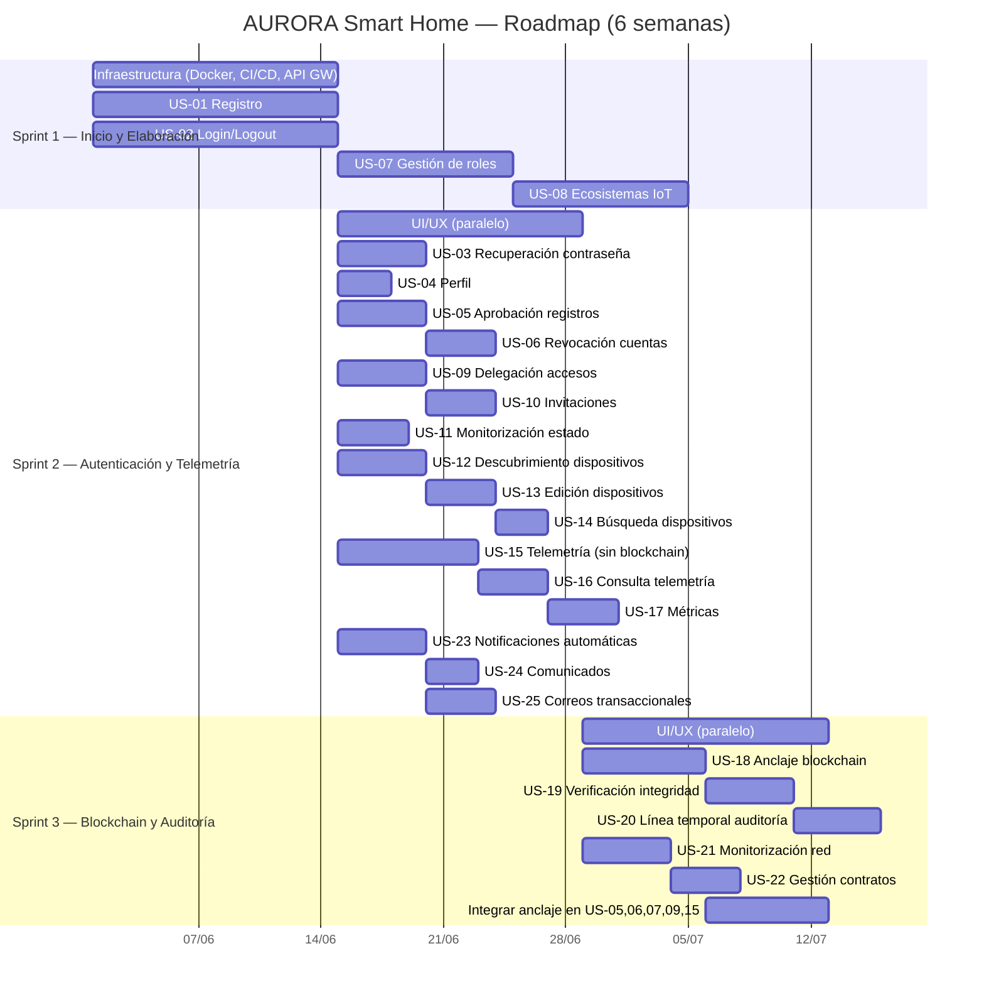
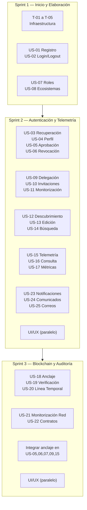

# AURORA Smart Home - Historias de Usuario

> **Propósito:** Este documento presenta el backlog priorizado de historias de usuario (Scrum) correlacionadas con los casos de uso (UML/UP) y los requisitos funcionales del sistema. Cada historia de usuario responde a uno o varios casos de uso y requisitos, asegurando trazabilidad bidireccional entre ambas metodologías.

---

## Convenciones

| Identificador | Sistema | Descripción |
|:---:|---|---|
| **US-XX** | User Story (Scrum) | Historia de usuario con criterios de aceptación |
| **T-XX** | Technical Story | Tarea técnica de infraestructura o arquitectura |
| **UC-XX** | Use Case (UML/UP) | Caso de uso del diagrama `casos_de_uso.puml` |
| **RF-XX** | Requisito Funcional | Requisito funcional de `REQUIREMENTS.md` |
| **RNF-XX** | Requisito No Funcional | Requisito no funcional de `REQUIREMENTS.md` |

**Prioridades:** 🔴 Alta | 🟡 Media | 🟢 Baja

---

## Distribución Temporal (3 Sprints × 2 semanas)

---

## Backlog Priorizado

### Sprint 1 — Inicio y Elaboración (Arquitectura Base)

**Objetivo:** Establecer la infraestructura base del sistema (Docker, API Gateway, CI/CD, segregación de servicios) y desarrollar las funcionalidades fundacionales de identidad y ecosistemas IoT.

#### Historias Técnicas

| ID | Nombre | Prioridad | RNF | Descripción |
|:--:|--------|:---------:|:---:|-------------|
| **T-01** | Contenerización y orquestación | 🔴 | RNF-014 | Definir Dockerfiles para cada servicio y archivo de composición con redes aisladas, volúmenes y política de reinicio. |
| **T-02** | API Gateway y enrutamiento | 🔴 | RNF-015, RNF-017, RNF-032 | Configurar punto único de entrada con enrutamiento por prefijo de ruta hacia los servicios internos. Proxy seguro de Docker socket. |
| **T-03** | Segregación de servicios | 🔴 | RNF-016 | Crear estructura de proyecto con servicios independientes: identidad, telemetría, blockchain y auditoría. Comunicación entre servicios vía HTTP con token interno (RNF-025). |
| **T-04** | Configuración y variables de entorno | 🔴 | RNF-034 | Implementar carga de configuración mediante variables de entorno en todos los servicios. Archivo `.env.example` con toda la documentación. |
| **T-05** | Integración continua y despliegue | 🔴 | RNF-012 | Pipeline CI/CD que ejecuta tests, construye imágenes Docker y despliega el stack completo. Health checks en cada servicio (RNF-019). |

#### Historias de Usuario

| US | Nombre | Prioridad | UC | RF | Épica |
|:--:|--------|:---------:|:--:|:--:|:------|
| **US-01** | Registro de usuario | 🔴 | UC-01 | RF-01 | Gestión de Identidad y Autenticación |
| **US-02** | Inicio y cierre de sesión | 🔴 | UC-02, UC-03 | RF-02 | Gestión de Identidad y Autenticación |
| **US-07** | Gestión de roles | 🔴 | UC-08 | RF-07 | Administración de Usuarios y Roles |
| **US-08** | Creación y edición de ecosistemas IoT | 🔴 | UC-09 | RF-08, RF-09 | Gestión de Ecosistemas IoT |

> **Nota:** US-07 y US-08 incluyen UC-19 (anclaje en blockchain). En Sprint 1 se implementa la lógica funcional sin anclaje blockchain. La integración con el servicio de anclaje se completa en Sprint 3.

---

### Sprint 2 — Construcción: Autenticación y Telemetría

**Objetivo:** Completar toda la gestión de identidad (recuperación, perfil, aprobación, revocación), la delegación de accesos a ecosistemas, la gestión completa de dispositivos IoT, la ingesta y consulta de telemetría, y el sistema de notificaciones. La UI/UX se desarrolla en paralelo con el backend.

| US | Nombre | Prioridad | UC | RF | Épica |
|:--:|--------|:---------:|:--:|:--:|:------|
| **US-03** | Recuperación de contraseña | 🟡 | UC-04 | RF-03 | Gestión de Identidad y Autenticación |
| **US-04** | Consulta de perfil | 🟡 | UC-05 | RF-04 | Gestión de Identidad y Autenticación |
| **US-05** | Aprobación de registros | 🔴 | UC-06 | RF-05 | Administración de Usuarios y Roles |
| **US-06** | Revocación de cuentas | 🟡 | UC-07 | RF-06 | Administración de Usuarios y Roles |
| **US-09** | Delegación de accesos a ecosistemas | 🟡 | UC-10 | RF-10 | Gestión de Ecosistemas IoT |
| **US-10** | Gestión de invitaciones | 🟡 | UC-11 | RF-11 | Gestión de Ecosistemas IoT |
| **US-11** | Monitorización de estado de ecosistemas | 🟡 | UC-12 | RF-12 | Gestión de Ecosistemas IoT |
| **US-12** | Descubrimiento automático de dispositivos | 🔴 | UC-13 | RF-13 | Gestión de Dispositivos |
| **US-13** | Edición de información de dispositivos | 🟡 | UC-14 | RF-14 | Gestión de Dispositivos |
| **US-14** | Búsqueda y filtrado de dispositivos | 🟡 | UC-15 | RF-15 | Gestión de Dispositivos |
| **US-15** | Recepción de telemetría IoT | 🔴 | UC-16 | RF-16 | Telemetría y Métricas |
| **US-16** | Consulta avanzada de telemetría | 🟡 | UC-17 | RF-17 | Telemetría y Métricas |
| **US-17** | Visualización de métricas | 🟡 | UC-18 | RF-18 | Telemetría y Métricas |
| **US-23** | Notificaciones automáticas | 🟡 | UC-24 | RF-24 | Comunicaciones y Notificaciones |
| **US-24** | Comunicados administrativos | 🟢 | UC-25 | RF-25 | Comunicaciones y Notificaciones |
| **US-25** | Envío de correos transaccionales | 🟡 | UC-26 | RF-26 | Comunicaciones y Notificaciones |

> **Nota:** US-05, US-06, US-09 y US-15 incluyen UC-19 (anclaje blockchain). En Sprint 2 se implementa la lógica funcional (aprobación, revocación, delegación, ingesta) sin el anclaje inmutable. La integración con el servicio de blockchain se completa en Sprint 3.

---

### Sprint 3 — Construcción: Blockchain y Auditoría

**Objetivo:** Implementar el servicio de blockchain y auditoría completo. Integrar el anclaje inmutable en todas las funcionalidades desarrolladas en Sprints 1 y 2 que lo requieran. Desarrollar los paneles de verificación de integridad, línea temporal de auditoría, monitorización de red y gestión de contratos. La UI/UX se desarrolla en paralelo.

| US | Nombre | Prioridad | UC | RF | Épica |
|:--:|--------|:---------:|:--:|:--:|:------|
| **US-18** | Anclaje inmutable de acciones en blockchain | 🔴 | UC-19 | RF-19 | Auditoría y Trazabilidad |
| **US-19** | Verificación de integridad de datos | 🔴 | UC-20 | RF-20 | Auditoría y Trazabilidad |
| **US-20** | Línea temporal de auditoría | 🟡 | UC-21 | RF-21 | Auditoría y Trazabilidad |
| **US-21** | Monitorización de red blockchain | 🟡 | UC-22 | RF-22 | Auditoría y Trazabilidad |
| **US-22** | Gestión de contratos de negocio | 🟢 | UC-23 | RF-23 | Auditoría y Trazabilidad |

> **Integraciones:** En este sprint se completa el anclaje blockchain de las US que lo requieren de sprints anteriores:
> - **US-05** (aprobación de registros) — anclar acción administrativa
> - **US-06** (revocación de cuentas) — anclar acción administrativa
> - **US-07** (gestión de roles) — anclar cambio de rol
> - **US-09** (delegación de accesos) — anclar delegación
> - **US-15** (recepción de telemetría) — anclar hash y firma de telemetría

---

## Detalle de Historias de Usuario

---

### US-01: Registro de usuario

| Campo | Valor |
|-------|-------|
| **Como** | Visitante |
| **Quiero** | registrarme en la plataforma proporcionando mi email y una contraseña segura |
| **Para** | poder acceder a las funcionalidades del sistema AURORA Smart Home |
| **Prioridad** | 🔴 Alta |
| **Sprint** | 1 |
| **RF** | RF-01 |
| **UC** | UC-01 (Registrarse) |
| **Épica** | Gestión de Identidad y Autenticación |

**Criterios de Aceptación:**
- El sistema valida que la contraseña no esté presente en bases de datos de credenciales comprometidas mediante modelo de privacidad diferencial (RNF-005).
- La contraseña se almacena con hash robusto con parámetros de coste adecuados (RNF-001).
- El usuario queda en estado "pendiente" hasta que un administrador apruebe su registro (RF-05).
- Se rechazan emails duplicados o con formato inválido.
- Se envía correo de bienvenida tras registro exitoso (integrado con US-25).

---

### US-02: Inicio y cierre de sesión

| Campo | Valor |
|-------|-------|
| **Como** | Usuario autenticable |
| **Quiero** | iniciar y cerrar sesión de forma segura en la plataforma |
| **Para** | acceder a los recursos autorizados y proteger mi cuenta al salir |
| **Prioridad** | 🔴 Alta |
| **Sprint** | 1 |
| **RF** | RF-02 |
| **UC** | UC-02 (Iniciar Sesión), UC-03 (Cerrar Sesión) |
| **Épica** | Gestión de Identidad y Autenticación |

**Criterios de Aceptación:**
- La autenticación usa tokens firmados asimétricamente (RNF-002).
- El access token se almacena solo en memoria volátil (RNF-006).
- El refresh token se almacena en cookie httpOnly segura (RNF-006, RNF-027).
- Al cerrar sesión se invalidan los tokens activos.
- Cuentas revocadas o bloqueadas reciben respuesta idéntica a "usuario no encontrado" (RNF-029).
- Cuentas inactivas por cambio de contraseña vencido son bloqueadas (RNF-028).

---

### US-03: Recuperación de contraseña

| Campo | Valor |
|-------|-------|
| **Como** | Usuario |
| **Quiero** | recuperar mi contraseña mediante un enlace seguro de un solo uso enviado a mi correo |
| **Para** | restaurar el acceso a mi cuenta cuando la haya olvidado |
| **Prioridad** | 🟡 Media |
| **Sprint** | 2 |
| **RF** | RF-03 |
| **UC** | UC-04 (Recuperar Contraseña) |
| **Épica** | Gestión de Identidad y Autenticación |

**Criterios de Aceptación:**
- El token de reseteo se almacena como hash, no en texto plano (RNF-039).
- El consumo del token es atómico para evitar doble uso (RNF-039).
- El enlace es de un solo uso y expira tras un período configurable.
- La nueva contraseña se valida contra credenciales comprometidas (RNF-005).
- Al completar el reseteo, la cuenta pasa a estado activo (RNF-028).

---

### US-04: Consulta de perfil

| Campo | Valor |
|-------|-------|
| **Como** | Usuario autenticado |
| **Quiero** | consultar mi información personal y estado de cuenta |
| **Para** | conocer mis datos registrados y el estado actual de mi cuenta |
| **Prioridad** | 🟡 Media |
| **Sprint** | 2 |
| **RF** | RF-04 |
| **UC** | UC-05 (Consultar Perfil) |
| **Épica** | Gestión de Identidad y Autenticación |

**Criterios de Aceptación:**
- Solo el usuario autenticado puede ver su propio perfil.
- Se muestra: email, rol, fecha de registro, estado de cuenta.
- No se exponen datos sensibles como tokens o hashes.

---

### US-05: Aprobación de registros

| Campo | Valor |
|-------|-------|
| **Como** | Administrador |
| **Quiero** | revisar y aprobar a los nuevos usuarios que se encuentren en estado pendiente |
| **Para** | controlar quién puede acceder al sistema |
| **Prioridad** | 🔴 Alta |
| **Sprint** | 2 (funcional), 3 (anclaje blockchain) |
| **RF** | RF-05 |
| **UC** | UC-06 (Aprobar Registros), UC-19 (Anclar Acción Administrativa) |
| **Épica** | Administración de Usuarios y Roles |

**Criterios de Aceptación:**
- El administrador ve una lista de usuarios pendientes con email y fecha de registro.
- Al aprobar, el usuario pasa a estado "activo" con rol Usuario por defecto.
- La acción de aprobación se muestra en el sistema.
- Se notifica al usuario por correo electrónico (US-25).
- Se muestra notificación interna al usuario (US-23).
- **Sprint 3:** La acción se ancla en blockchain con metadatos completos (RNF-010, RNF-026).

---

### US-06: Revocación de cuentas

| Campo | Valor |
|-------|-------|
| **Como** | Administrador |
| **Quiero** | bloquear el acceso a usuarios específicos |
| **Para** | impedir su inicio de sesión sin eliminar su historial |
| **Prioridad** | 🟡 Media |
| **Sprint** | 2 (funcional), 3 (anclaje blockchain) |
| **RF** | RF-06 |
| **UC** | UC-07 (Revocar Cuentas), UC-19 (Anclar Acción Administrativa) |
| **Épica** | Administración de Usuarios y Roles |

**Criterios de Aceptación:**
- El email del usuario revocado se ofusca en base de datos (RNF-029).
- Los intentos de inicio de sesión con cuenta revocada responden como "usuario no encontrado" (RNF-029).
- Las listas de usuarios excluyen revocados por defecto.
- El usuario recibe notificación de su revocación.
- **Sprint 3:** La acción se ancla en blockchain (RNF-010).

---

### US-07: Gestión de roles

| Campo | Valor |
|-------|-------|
| **Como** | Administrador |
| **Quiero** | asignar diferentes niveles de privilegio (Usuario, Auditor, Administrador) a las cuentas registradas |
| **Para** | controlar los permisos de cada usuario en el sistema |
| **Prioridad** | 🔴 Alta |
| **Sprint** | 1 (funcional), 3 (anclaje blockchain) |
| **RF** | RF-07 |
| **UC** | UC-08 (Gestionar Roles), UC-19 (Anclar Acción Administrativa) |
| **Épica** | Administración de Usuarios y Roles |

**Criterios de Aceptación:**
- El Administrador puede asignar roles Usuario, Auditor o Administrador.
- El rol GLOBAL_ADMIN es único y no puede asignarse ni modificarse (RF-07).
- El usuario recibe notificación del cambio de rol.
- Se aplica RBAC en todos los endpoints del sistema (RNF-018).
- **Sprint 3:** La acción de cambio de rol se ancla en blockchain (RNF-010).

---

### US-08: Creación y edición de ecosistemas IoT

| Campo | Valor |
|-------|-------|
| **Como** | Usuario |
| **Quiero** | registrar y configurar nuevos entornos IoT con nombre y ubicación geográfica |
| **Para** | organizar mis dispositivos y que el sistema genere las credenciales necesarias para su operación segura |
| **Prioridad** | 🔴 Alta |
| **Sprint** | 1 |
| **RF** | RF-08, RF-09 |
| **UC** | UC-09 (Crear o Editar Ecosistema + Generar Credenciales) |
| **Épica** | Gestión de Ecosistemas IoT |

**Criterios de Aceptación:**
- El usuario define nombre y ubicación geográfica del ecosistema.
- El sistema genera automáticamente las claves de acceso (API Key) para el ecosistema.
- La API Key se genera con suficiente entropía (RNF-003).
- La API Key se cifra antes de almacenarse (RNF-003).
- Las claves privadas del ecosistema se almacenan cifradas (RNF-004).
- Solo el propietario y administradores pueden editar el ecosistema.

---

### US-09: Delegación de accesos a ecosistemas

| Campo | Valor |
|-------|-------|
| **Como** | Usuario propietario de un ecosistema |
| **Quiero** | invitar a otros usuarios con permisos de solo lectura o de gestión |
| **Para** | compartir el control de mi ecosistema IoT de forma controlada |
| **Prioridad** | 🟡 Media |
| **Sprint** | 2 (funcional), 3 (anclaje blockchain) |
| **RF** | RF-10 |
| **UC** | UC-10 (Delegar Accesos), UC-19 (Anclar Acción Administrativa) |
| **Épica** | Gestión de Ecosistemas IoT |

**Criterios de Aceptación:**
- El propietario selecciona un usuario registrado y le asigna permisos (lectura o gestión).
- El administrador del sistema tiene siempre acceso de lectura a todos los ecosistemas (RF-10).
- El usuario invitado recibe una notificación (US-23) y un correo (US-25).
- **Sprint 3:** La delegación se registra en blockchain.

---

### US-10: Gestión de invitaciones

| Campo | Valor |
|-------|-------|
| **Como** | Usuario |
| **Quiero** | aceptar o rechazar las invitaciones a ecosistemas de terceros |
| **Para** | decidir a qué entornos IoT quiero tener acceso |
| **Prioridad** | 🟡 Media |
| **Sprint** | 2 |
| **RF** | RF-11 |
| **UC** | UC-11 (Gestionar Invitaciones) |
| **Épica** | Gestión de Ecosistemas IoT |

**Criterios de Aceptación:**
- El usuario ve un listado de invitaciones pendientes con el nombre del ecosistema y el propietario.
- Al aceptar, obtiene los permisos asignados por el propietario.
- Al rechazar, la invitación se descarta y se notifica al propietario.

---

### US-11: Monitorización de estado de ecosistemas

| Campo | Valor |
|-------|-------|
| **Como** | Sistema |
| **Quiero** | registrar y mostrar el estado de conexión actual de cada ecosistema IoT |
| **Para** | que los usuarios sepan si sus dispositivos están operativos |
| **Prioridad** | 🟡 Media |
| **Sprint** | 2 |
| **RF** | RF-12 |
| **UC** | UC-12 (Monitorizar Estado) |
| **Épica** | Gestión de Ecosistemas IoT |

**Criterios de Aceptación:**
- El sistema detecta conexión/desconexión de cada ecosistema.
- El estado se muestra en tiempo real a los usuarios autorizados.
- Se registra el historial de cambios de estado.

---

### US-12: Descubrimiento automático de dispositivos

| Campo | Valor |
|-------|-------|
| **Como** | Sistema |
| **Quiero** | detectar y registrar automáticamente nuevos dispositivos IoT cuando interactúan con la plataforma |
| **Para** | que los dispositivos se integren sin configuración manual |
| **Prioridad** | 🔴 Alta |
| **Sprint** | 2 |
| **RF** | RF-13 |
| **UC** | UC-13 (Descubrir Dispositivos) |
| **Épica** | Gestión de Dispositivos |

**Criterios de Aceptación:**
- Cuando un origen no catalogado envía datos, el sistema crea un nuevo registro de dispositivo.
- El dispositivo se asigna automáticamente al ecosistema correspondiente.
- El dispositivo se crea con estado "no clasificado" hasta que el usuario lo edite.

---

### US-13: Edición de información de dispositivos

| Campo | Valor |
|-------|-------|
| **Como** | Usuario |
| **Quiero** | clasificar mis dispositivos por categorías, asignarles nombres personalizados y ubicarlos por habitaciones |
| **Para** | organizar mi ecosistema IoT de forma comprensible |
| **Prioridad** | 🟡 Media |
| **Sprint** | 2 |
| **RF** | RF-14 |
| **UC** | UC-14 (Editar Dispositivos) |
| **Épica** | Gestión de Dispositivos |

**Criterios de Aceptación:**
- El usuario puede cambiar nombre, categoría, habitación y fabricante del dispositivo.
- Las categorías se validan contra el catálogo fijo definido (RNF-033).
- El vendor se resuelve mediante API externa con caché (RNF-040).
- Solo usuarios con permisos sobre el ecosistema pueden editar sus dispositivos.

---

### US-14: Búsqueda y filtrado de dispositivos

| Campo | Valor |
|-------|-------|
| **Como** | Usuario |
| **Quiero** | buscar dispositivos por nombre, categoría, fabricante o identificador de red |
| **Para** | localizar rápidamente dispositivos específicos dentro de mis ecosistemas |
| **Prioridad** | 🟡 Media |
| **Sprint** | 2 |
| **RF** | RF-15 |
| **UC** | UC-15 (Buscar Dispositivos) |
| **Épica** | Gestión de Dispositivos |

**Criterios de Aceptación:**
- El buscador permite filtrar por nombre, categoría, fabricante e ID de red.
- Solo se muestran dispositivos de ecosistemas a los que el usuario tiene acceso.
- Los resultados se presentan de forma paginada y ordenable.

---

### US-15: Recepción de telemetría IoT

| Campo | Valor |
|-------|-------|
| **Como** | Dispositivo IoT |
| **Quiero** | enviar datos de telemetría a la plataforma de forma segura |
| **Para** | que el sistema procese, almacene y ancle la información de forma inmutable |
| **Prioridad** | 🔴 Alta |
| **Sprint** | 2 (ingesta), 3 (anclaje blockchain) |
| **RF** | RF-16 |
| **UC** | UC-16 (Recibir Telemetría + Validar API Key + Anclar en Blockchain) |
| **Épica** | Telemetría y Métricas |

**Criterios de Aceptación:**
- **Sprint 2:** La API Key del ecosistema se valida con caché (RNF-007) y fallback a servicio de identidad.
- **Sprint 2:** El mapa estático de API Keys funciona para desarrollo (RNF-038).
- **Sprint 2:** La telemetría se almacena en colección optimizada para series temporales (RNF-008).
- **Sprint 2:** Todos los endpoints de servicios internos se autentican con token compartido (RNF-025).
- **Sprint 3:** Se calcula el hash del payload normalizado más coordenadas GPS (RNF-021).
- **Sprint 3:** El hash se firma digitalmente con la clave privada del ecosistema (RNF-022).
- **Sprint 3:** El hash y la firma se anclan en blockchain (RNF-009, RNF-010).
- **Sprint 3:** El modo de anclaje es configurable (bloqueante/no bloqueante) (RNF-031).
- **Sprint 3:** Reintentos configurables si falla el anclaje (RNF-030).

---

### US-16: Consulta avanzada de telemetría

| Campo | Valor |
|-------|-------|
| **Como** | Usuario o Auditor |
| **Quiero** | consultar el histórico de telemetría con filtros por fecha, ecosistema y estado de anclaje |
| **Para** | analizar el comportamiento de mis dispositivos IoT a lo largo del tiempo |
| **Prioridad** | 🟡 Media |
| **Sprint** | 2 |
| **RF** | RF-17 |
| **UC** | UC-17 (Consultar Telemetría) |
| **Épica** | Telemetría y Métricas |

**Criterios de Aceptación:**
- Filtros disponibles: rango de fechas, ecosistema(s), estado de anclaje.
- Resultados paginados con ordenación por timestamp.
- Los auditores pueden ver telemetría de todos los ecosistemas.

---

### US-17: Visualización de métricas

| Campo | Valor |
|-------|-------|
| **Como** | Usuario |
| **Quiero** | ver resúmenes con volúmenes de eventos y actividad reciente de mis ecosistemas |
| **Para** | obtener una visión rápida del estado y uso de mi plataforma IoT |
| **Prioridad** | 🟡 Media |
| **Sprint** | 2 |
| **RF** | RF-18 |
| **UC** | UC-18 (Visualizar Métricas) |
| **Épica** | Telemetría y Métricas |

**Criterios de Aceptación:**
- Se muestran: total de eventos, eventos por período, ecosistemas activos.
- Las métricas se agregan por hora, día o semana.
- Auditores y administradores ven métricas globales.

---

### US-18: Anclaje inmutable de acciones en blockchain

| Campo | Valor |
|-------|-------|
| **Como** | Sistema |
| **Quiero** | registrar automáticamente en blockchain las acciones administrativas críticas y eventos de telemetría |
| **Para** | garantizar una pista de auditoría inmutable y verificable |
| **Prioridad** | 🔴 Alta |
| **Sprint** | 3 |
| **RF** | RF-19 |
| **UC** | UC-19 (Anclar Acción Administrativa) |
| **Épica** | Auditoría y Trazabilidad |

**Criterios de Aceptación:**
- Cada acción incluye metadatos: actor, target, tipo, descripción, firma y nonce (RNF-010).
- El nonce previene ataques de replay (RNF-026).
- Modo de anclaje configurable: bloqueante o no bloqueante (RNF-031).
- Reintentos configurables en caso de fallo (RNF-030).
- Una vez implantado, se integra con: US-05, US-06, US-07, US-09, US-15.

---

### US-19: Verificación de integridad de datos

| Campo | Valor |
|-------|-------|
| **Como** | Auditor |
| **Quiero** | comprobar que los datos almacenados no han sido alterados desde su registro original en blockchain |
| **Para** | garantizar la confianza en la información del sistema |
| **Prioridad** | 🔴 Alta |
| **Sprint** | 3 |
| **RF** | RF-20 |
| **UC** | UC-20 (Verificar Integridad) |
| **Épica** | Auditoría y Trazabilidad |

**Criterios de Aceptación:**
- El sistema permite seleccionar un registro y verificar su hash contra el anclado en blockchain.
- Se verifica la firma digital con la clave pública almacenada en el anchor.
- El resultado indica si los datos son íntegros o han sido alterados.

---

### US-20: Línea temporal de auditoría

| Campo | Valor |
|-------|-------|
| **Como** | Auditor |
| **Quiero** | un visor cronológico de todos los eventos anclados con capacidades de filtrado y búsqueda |
| **Para** | investigar la secuencia de acciones en el sistema |
| **Prioridad** | 🟡 Media |
| **Sprint** | 3 |
| **RF** | RF-21 |
| **UC** | UC-21 (Consultar Línea Temporal) |
| **Épica** | Auditoría y Trazabilidad |

**Criterios de Aceptación:**
- Los eventos se muestran ordenados cronológicamente.
- Filtros por actor, tipo de acción, rango de fechas y target.
- Desde la línea temporal se puede acceder a la verificación de integridad (UC-20 extiende UC-21).

---

### US-21: Monitorización de red blockchain

| Campo | Valor |
|-------|-------|
| **Como** | Administrador Global |
| **Quiero** | visualizar el estado de los nodos, organizaciones y bloques de la red blockchain |
| **Para** | supervisar la salud y operación de la red de confianza subyacente |
| **Prioridad** | 🟡 Media |
| **Sprint** | 3 |
| **RF** | RF-22 |
| **UC** | UC-22 (Monitorizar Red Blockchain) |
| **Épica** | Auditoría y Trazabilidad |

**Criterios de Aceptación:**
- Se muestra: lista de nodos con su estado, organizaciones participantes, altura de bloques.
- Actualización periódica de la información.
- Acceso exclusivo para usuarios con rol GLOBAL_ADMIN.

---

### US-22: Gestión de contratos de negocio

| Campo | Valor |
|-------|-------|
| **Como** | Administrador Global |
| **Quiero** | registrar o dar de baja las reglas lógicas que rigen el registro inmutable |
| **Para** | gestionar los contratos inteligentes de la plataforma |
| **Prioridad** | 🟢 Baja |
| **Sprint** | 3 |
| **RF** | RF-23 |
| **UC** | UC-23 (Gestionar Contratos) |
| **Épica** | Auditoría y Trazabilidad |

**Criterios de Aceptación:**
- El GLOBAL_ADMIN puede desplegar nuevos contratos o desactivar existentes.
- Las operaciones quedan registradas en la auditoría del sistema.
- Acceso exclusivo para rol GLOBAL_ADMIN.

---

### US-23: Notificaciones automáticas

| Campo | Valor |
|-------|-------|
| **Como** | Sistema |
| **Quiero** | generar avisos internos ante eventos clave (cambios de rol, invitaciones, aprobaciones de cuenta) |
| **Para** | mantener informados a los usuarios sin necesidad de correo electrónico |
| **Prioridad** | 🟡 Media |
| **Sprint** | 2 |
| **RF** | RF-24 |
| **UC** | UC-24 (Enviar Notificaciones Automáticas) |
| **Épica** | Comunicaciones y Notificaciones |

**Criterios de Aceptación:**
- Se genera notificación para: invitación a ecosistema, cambio de rol, aprobación/revocación de cuenta.
- Las notificaciones se muestran en un panel interno.
- El usuario puede marcar notificaciones como leídas.

---

### US-24: Comunicados administrativos

| Campo | Valor |
|-------|-------|
| **Como** | Administrador |
| **Quiero** | enviar notificaciones manuales a usuarios específicos o grupos según su rol |
| **Para** | comunicar información importante a segmentos de la plataforma |
| **Prioridad** | 🟢 Baja |
| **Sprint** | 2 |
| **RF** | RF-25 |
| **UC** | UC-25 (Enviar Comunicados) |
| **Épica** | Comunicaciones y Notificaciones |

**Criterios de Aceptación:**
- El administrador redacta un mensaje y selecciona destinatarios por rol o usuarios específicos.
- El comunicado aparece en el panel de notificaciones de los destinatarios.
- El GLOBAL_ADMIN puede enviar comunicados a todos los roles.

---

### US-25: Envío de correos transaccionales

| Campo | Valor |
|-------|-------|
| **Como** | Sistema |
| **Quiero** | enviar correos electrónicos automáticos para acciones críticas |
| **Para** | acompañar eventos como bienvenidas, recuperaciones o alertas de seguridad |
| **Prioridad** | 🟡 Media |
| **Sprint** | 2 |
| **RF** | RF-26 |
| **UC** | UC-26 (Enviar Correos Transaccionales) |
| **Épica** | Comunicaciones y Notificaciones |

**Criterios de Aceptación:**
- Correos enviados para: bienvenida tras registro, enlace de recuperación de contraseña, cambios de estado de cuenta.
- Las plantillas de correo son configurables.
- El envío se realiza de forma asíncrona para no bloquear la operación principal.

---

## Matriz de Trazabilidad Completa

| User Story | Sprint | UC Relacionados | RF Relacionados | RNF Relacionados | Prioridad |
|:----------:|:-----:|:---------------:|:---------------:|:----------------:|:---------:|
| US-01 | 1 | UC-01 | RF-01 | RNF-001, RNF-005 | 🔴 |
| US-02 | 1 | UC-02, UC-03 | RF-02 | RNF-002, RNF-006, RNF-027, RNF-029, RNF-028 | 🔴 |
| US-03 | 2 | UC-04 | RF-03 | RNF-005, RNF-039, RNF-028 | 🟡 |
| US-04 | 2 | UC-05 | RF-04 | — | 🟡 |
| US-05 | 2→3 | UC-06, UC-19 | RF-05 | RNF-010, RNF-026 | 🔴 |
| US-06 | 2→3 | UC-07, UC-19 | RF-06 | RNF-010, RNF-029 | 🟡 |
| US-07 | 1→3 | UC-08, UC-19 | RF-07 | RNF-010, RNF-018 | 🔴 |
| US-08 | 1 | UC-09 | RF-08, RF-09 | RNF-003, RNF-004 | 🔴 |
| US-09 | 2→3 | UC-10, UC-19 | RF-10 | RNF-010 | 🟡 |
| US-10 | 2 | UC-11 | RF-11 | — | 🟡 |
| US-11 | 2 | UC-12 | RF-12 | — | 🟡 |
| US-12 | 2 | UC-13 | RF-13 | — | 🔴 |
| US-13 | 2 | UC-14 | RF-14 | RNF-033, RNF-040 | 🟡 |
| US-14 | 2 | UC-15 | RF-15 | — | 🟡 |
| US-15 | 2→3 | UC-16 | RF-16 | RNF-007, RNF-008, RNF-009, RNF-021, RNF-022, RNF-025, RNF-030, RNF-031, RNF-038 | 🔴 |
| US-16 | 2 | UC-17 | RF-17 | — | 🟡 |
| US-17 | 2 | UC-18 | RF-18 | — | 🟡 |
| US-18 | 3 | UC-19 | RF-19 | RNF-010, RNF-026, RNF-030, RNF-031 | 🔴 |
| US-19 | 3 | UC-20 | RF-20 | RNF-009, RNF-022 | 🔴 |
| US-20 | 3 | UC-21 | RF-21 | — | 🟡 |
| US-21 | 3 | UC-22 | RF-22 | — | 🟡 |
| US-22 | 3 | UC-23 | RF-23 | — | 🟢 |
| US-23 | 2 | UC-24 | RF-24 | — | 🟡 |
| US-24 | 2 | UC-25 | RF-25 | — | 🟢 |
| US-25 | 2 | UC-26 | RF-26 | — | 🟡 |

> Sprint `X→Y` indica que la funcionalidad base se entrega en el sprint X y la integración blockchain se completa en el sprint Y.

---

## Resumen

| Tipo | Cantidad | IDs |
|------|:--------:|-----|
| **Historias de Usuario** | 25 | US-01 → US-25 |
| **Historias Técnicas** | 5 | T-01 → T-05 |
| **Casos de Uso cubiertos** | 26 | UC-01 → UC-26 |
| **Requisitos Funcionales cubiertos** | 26 | RF-01 → RF-26 |

### Distribución por Prioridad

| Prioridad | Cantidad | US |
|:---------:|:--------:|:---|
| 🔴 Alta | 9 | US-01, US-02, US-05, US-07, US-08, US-12, US-15, US-18, US-19 |
| 🟡 Media | 14 | US-03, US-04, US-06, US-09, US-10, US-11, US-13, US-14, US-16, US-17, US-20, US-21, US-23, US-25 |
| 🟢 Baja | 2 | US-22, US-24 |

### Distribución por Sprint

| Sprint | Duración | US / T | Enfoque |
|:------:|:--------:|:------:|---------|
| **Sprint 1** — Inicio y Elaboración | 2 semanas | T-01 a T-05, US-01, US-02, US-07, US-08 | Arquitectura base (Docker, CI/CD, API GW), identidad fundacional, ecosistemas IoT |
| **Sprint 2** — Construcción (Auth y Telemetría) | 2 semanas | US-03 a US-06, US-09 a US-17, US-23 a US-25 | Autenticación completa, gestión dispositivos, telemetría, notificaciones. UI/UX en paralelo |
| **Sprint 3** — Construcción (Blockchain y Auditoría) | 2 semanas | US-18 a US-22 + integraciones | Anclaje blockchain, verificación, auditoría, contratos. UI/UX en paralelo |

### Distribución de Casos de Uso por Sprint

| Sprint | Casos de Uso |
|:------:|:-------------|
| **Sprint 1** | UC-01, UC-02, UC-03, UC-08, UC-09 |
| **Sprint 2** | UC-04, UC-05, UC-06, UC-07, UC-10, UC-11, UC-12, UC-13, UC-14, UC-15, UC-16 (parcial), UC-17, UC-18, UC-24, UC-25, UC-26 |
| **Sprint 3** | UC-16 (anclaje), UC-19, UC-20, UC-21, UC-22, UC-23 |

### Cobertura de Objetivos por Sprint

